# Regresión lineal {#regresion}


## Introducción

Consideramos un problema de regresión con entradas $X=(X_1,X_2,\ldots, X_p)$
y respuesta $Y$. Una de las maneras más simples que podemos intentar
para predecir $Y$ en función de las $X_j$´s es mediante una suma ponderada
de los valores de las $X_j's$, usando una función

$$f_\beta (X) = \beta_0 + \beta_1 X_1 + \beta_2 X_2 + \cdots + \beta_p X_p,$$
Nuestro trabajo será entonces, dada una muestra de entrenamiento ${\mathcal L}$,
encontrar valores apropiados de las $\beta$'s, para construir un predictor:

$$\hat{f}(X) = \hat{\beta}_0 + \hat{\beta}_1 X_1 + \hat{\beta}_2 X_2 \cdots + \hat{\beta} X_p$$
y usaremos esta función $\hat{f}$ para hacer predicciones $\hat{Y} =\hat{f}(X)$.


#### Ejemplos
Queremos predecir las ventas futuras anuales $Y$ de un supermercado que se va a construir
en un lugar dado. Las variables que describen el lugar son
$X_1 = trafico\_peatones$, $X_2=trafico\_coches$. En una aproximación simple,
podemos suponer que la tienda va a capturar una fracción de esos tráficos que
se van a convertir en ventas. Quisieramos predecir con una función de la forma
$$f_\beta (peatones, coches) = \beta_0 + \beta_1\, peatones + \beta_2\, coches.$$
Por ejemplo, después de un análisis estimamos que 

- $\hat{\beta}_0 = 1000000$ (ventas base)
- $\hat{\beta}_1 = (200)*0.02 = 4$
- $\hat{\beta}_2 = (300)*0.01 =3$

Entonces haríamos predicciones con
$$\hat{f}(peatones, coches) = 1000000 +  4\,peatones + 3\, coches$$

El modelo lineal es más flexible de lo que parece en una primera aproximación, porque
tenemos libertad para construir las variables de entrada a partir de nuestros datos.
Por ejemplo, si tenemos una tercera variable 
$estacionamiento$ que vale 1 si hay un estacionamiento cerca o 0 si no lo hay, podríamos
definir las variables

- $X_1= peatones$
- $X_2 = coches$
- $X_3 = estacionamiento$
- $X_4 = coches*estacionamiento$

Donde la idea de agregar $X_4$ es que si hay estacionamiento entonces vamos
a capturar una fracción adicional del trafico de coches, y la idea de $X_3$ es que 
la tienda atraerá más nuevas visitas si hay un estacionamiento cerca. Buscamos 
ahora modelos de la forma

$$f_\beta(X_1,X_2,X_3,X_4) = \beta_0 + \beta_1X_1 + \beta_2 X_2 + \beta_3 X_3 +\beta_4 X_4$$

y podríamos obtener después de nuestra análisis las estimaciones


- $\hat{\beta}_0 = 800000$ (ventas base)
- $\hat{\beta}_1 = 4$
- $\hat{\beta}_2 = (300)*0.005 = 1.5$
- $\hat{\beta}_3 = 400000$
- $\hat{\beta}_4 = (300)*0.02 = 6$
 
 y entonces haríamos predicciones con el modelo

$$\hat{f} (X_1,X_2,X_3,X_4) = 
800000 + 4\, X_1 + 1.5 \,X_2 + 400000\, X_3 +6\, X_4$$

## Aprendizaje de coeficientes (ajuste)

En el ejemplo anterior, los coeficientes fueron calculados (o estimados) usando
experiencia, argumentos teóricos, o quizá otras fuentes de datos (como estudios
o encuestas, conteos, etc.) 

Ahora quisiéramos construir un algoritmo para
aprender estos coeficientes del modelo

$$f_\beta (X_1) = \beta_0 + \beta_1 X_1 + \cdots \beta_p X_p$$
a partir de una muestra de entrenamiento

$${\mathcal L}=\{ (x^{(1)},y^{(1)}),(x^{(2)},y^{(2)}), \ldots, (x^{(N)}, y^{(N)}) \}$$

El criterio de ajuste (algoritmo de aprendizaje) más usual para regresión 
lineal es el de **mínimos cuadrados**. 

Construimos las predicciones (ajustados) para la muestra de entrenamiento:
$$\hat{y}^{(i)} =  f_\beta (x^{(i)}) = \beta_0 + \beta_1 x_1^{(i)}+ \cdots + \beta_p x_p^{(i)}$$

Y consideramos las diferencias de los ajustados con los valores observados:

$$e^{(i)} = y^{(i)} - f_\beta (x^{(i)})$$

La idea entonces es minimizar la suma de los residuales al cuadrado, para
intentar que la función ajustada pase lo más cercana a los puntos de entrenamiento 
que sea posible. Si

$$RSS(\beta) = \sum_{i=1}^N (y^{(i)} - f_\beta(x^{(i)}))^2$$
Queremos resolver

<div class="comentario">
<p><strong>Mínimos cuadrados</strong></p>
<p><span class="math display">\[\min_{\beta} RSS(\beta) = \min_{\beta}\sum_{i=1}^N (y^{(i)} - f_\beta(x^{(i)}))^2\]</span></p>
</div>

**Observación**:
Como discutimos al final de las sección anterior, minimizar directamente el error
 de entrenamiento para encontrar los coeficientes puede resultar en en un modelo
 sobreajustado/con varianza alta/ruidoso. En la sección anterior discutimos
 tres grandes estrategias para mitigar este problema (restringir la familia
 de funciones, penalizar la función objetivo, perturbar la muestra de entrenamiento).
 El método mas común es cambiar la función objetivo, que discutiremos más adelante
 en la sección de regularización.


#### Ejemplo

Consideremos 


```r
library(readr)
library(dplyr)
library(knitr)
prostata <- read_csv('datos/prostate.csv') %>% select(lcavol, lpsa, train)
kable(head(prostata), format = 'html')
```

<table>
 <thead>
  <tr>
   <th style="text-align:right;"> lcavol </th>
   <th style="text-align:right;"> lpsa </th>
   <th style="text-align:left;"> train </th>
  </tr>
 </thead>
<tbody>
  <tr>
   <td style="text-align:right;"> -0.5798185 </td>
   <td style="text-align:right;"> -0.4307829 </td>
   <td style="text-align:left;"> TRUE </td>
  </tr>
  <tr>
   <td style="text-align:right;"> -0.9942523 </td>
   <td style="text-align:right;"> -0.1625189 </td>
   <td style="text-align:left;"> TRUE </td>
  </tr>
  <tr>
   <td style="text-align:right;"> -0.5108256 </td>
   <td style="text-align:right;"> -0.1625189 </td>
   <td style="text-align:left;"> TRUE </td>
  </tr>
  <tr>
   <td style="text-align:right;"> -1.2039728 </td>
   <td style="text-align:right;"> -0.1625189 </td>
   <td style="text-align:left;"> TRUE </td>
  </tr>
  <tr>
   <td style="text-align:right;"> 0.7514161 </td>
   <td style="text-align:right;"> 0.3715636 </td>
   <td style="text-align:left;"> TRUE </td>
  </tr>
  <tr>
   <td style="text-align:right;"> -1.0498221 </td>
   <td style="text-align:right;"> 0.7654678 </td>
   <td style="text-align:left;"> TRUE </td>
  </tr>
</tbody>
</table>

```r
prostata_entrena <- filter(prostata, train)
ggplot(prostata_entrena, aes(x = lcavol, y = lpsa)) + geom_point()
```

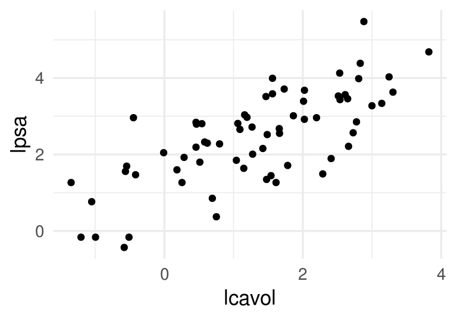

En este caso, buscamos ajustar el modelo (tenemos una sola entrada)
$f_{\beta} (X_1) = \beta_0 + \beta_1 X_1$,
que es una recta. Los cálculos serían como sigue:


```r
rss_calc <- function(datos){
  # esta función recibe los datos (x,y) y devuelve
  # una función f(betas) que calcula rss
  y <- datos$lpsa
  x <- datos$lcavol
  fun_out <- function(beta){
    y_hat <- beta[1] + beta[2]*x
    e <- (y - y_hat)
    rss <- sum(e^2)
    0.5*rss
  }
  fun_out
}
```

Nuestra función rss es entonces:


```r
rss_prostata <- rss_calc(prostata_entrena)
```

Por ejemplo, si consideramos $(\beta_0, \beta_1) = (0, 1.5)$, obtenemos


```r
beta <- c(0,1.5)
rss_prostata(beta)
```

```
## [1] 61.63861
```
Que corresponde a la recta


```r
ggplot(prostata_entrena, aes(x = lcavol, y = lpsa)) + geom_point() +
  geom_abline(slope = beta[2], intercept = beta[1], col ='red')
```

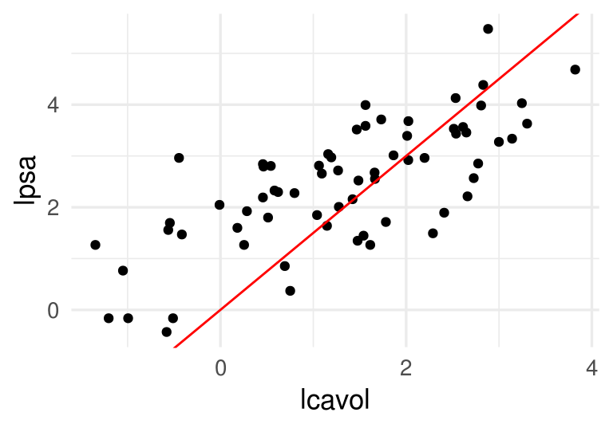

Podemos comparar con  $(\beta_0, \beta_1) = (1, 1)$, obtenemos


```r
beta <- c(1,1)
rss_prostata(beta)
```

```
## [1] 27.11781
```

```r
ggplot(prostata_entrena, aes(x = lcavol, y = lpsa)) + geom_point() +
  geom_abline(slope = beta[2], intercept = beta[1], col ='red')
```

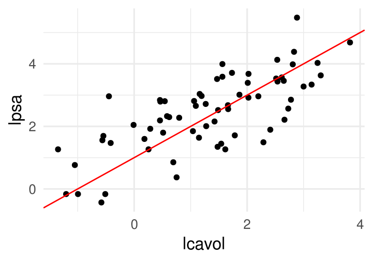

Ahora minimizamos. Podríamos hacer


```r
res_opt <- optim(c(0,0), rss_prostata, method = 'BFGS')
beta_hat <- res_opt$par
beta_hat
```

```
## [1] 1.5163048 0.7126351
```

```r
res_opt$convergence
```

```
## [1] 0
```


```r
ggplot(prostata_entrena, aes(x = lcavol, y = lpsa)) + geom_point() +
  geom_abline(slope = 1, intercept = 1, col ='red') +
  geom_abline(slope = beta_hat[2], intercept = beta_hat[1], size = 1.2) 
```

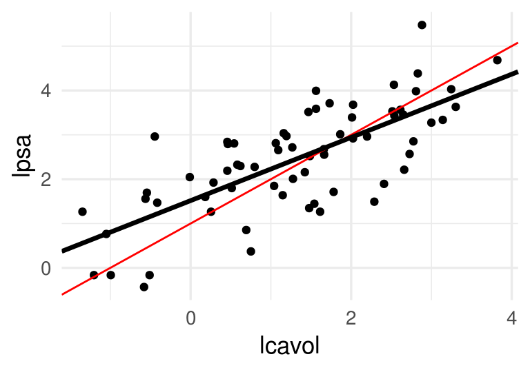


## Descenso en gradiente

Aunque el problema de mínimos cuadrados se puede resolver analíticamente, proponemos
un método numérico básico que es efectivo y puede escalarse a problemas grandes
de manera relativamente simple: descenso en gradiente, o descenso máximo.

Supongamos que una función $h(x)$ es convexa y tiene un mínimo. La idea
de descenso en gradiente es comenzar con un candidato inicial $z_0$ y calcular
la derivada en $z^{(0)}$. Si $h(z^{(0)})>0$, la función es creciente en $z^{(0)}$ y nos
movemos ligeramente 
a la izquierda para obtener un nuevo candidato $z^{(1)}$. si $h(z^{(0)})<0$, la
función es decreciente en $z^{(0)}$ y nos
movemos ligeramente a la derecha  para obtener un nuevo candidato $z^{(1)}$. Iteramos este
proceso hasta que la derivada es cercana a cero (estamos cerca del óptimo).

Si $\eta>0$ es una cantidad chica, podemos escribir

$$z^{(1)} = z^{(0)} - \eta \,h'(z^{(0)}).$$

Nótese que cuando la derivada tiene magnitud alta, el movimiento de $z^{(0)}$ a $z^{(1)}$
es más grande, y siempre nos movemos una fracción de la derivada. En general hacemos
$$z^{(j+1)} = z^{(j)} - \eta\,h'(z^{(j)})$$
para obtener una sucesión $z^{(0)},z^{(1)},\ldots$. Esperamos a que $z^{(j)}$ converja
para terminar la iteración.


#### Ejemplo

Si tenemos

```r
h <- function(x) x^2 + (x - 2)^2 - log(x^2 + 1)
```

Calculamos (a mano):

```r
h_deriv <- function(x) 2 * x + 2 * (x - 2) - 2*x/(x^2 + 1)
```

Ahora iteramos con $\eta = 0.4$ y valor inicial $z_0=5$

```r
z_0 <- 5
eta <- 0.4
descenso <- function(n, z_0, eta, h_deriv){
  z <- matrix(0,n, length(z_0))
  z[1, ] <- z_0
  for(i in 1:(n-1)){
    z[i+1, ] <- z[i, ] - eta * h_deriv(z[i, ])
  }
  z
}
z <- descenso(15, 5, eta, h_deriv)
z
```

```
##             [,1]
##  [1,]  5.0000000
##  [2,] -1.2461538
##  [3,]  1.9571861
##  [4,]  0.7498212
##  [5,]  1.5340816
##  [6,]  1.0455267
##  [7,]  1.3722879
##  [8,]  1.1573987
##  [9,]  1.3013251
## [10,]  1.2057209
## [11,]  1.2696685
## [12,]  1.2270627
## [13,]  1.2555319
## [14,]  1.2365431
## [15,]  1.2492245
```

Y vemos que estamos cerca de la convergencia.


```r
dat_iteraciones <- data_frame(iteracion = 1:nrow(z), 
                              x = z[, 1], y = h(z[, 1]))
graf_descenso <- ggplot(dat_iteraciones, aes(x = x, y = y)) +
    stat_function(fun = h) +
    geom_point(size = 4, color = "red") +
    xlim(c(-2, 5)) 
```


```r
if(FALSE){
   library(gganimate)
   graf_descenso + 
        labs(title = 'Iteración: {frame_time}') +
        transition_time(iteracion)
    anim_save(filename = "figuras/descenso_1.gif")
}
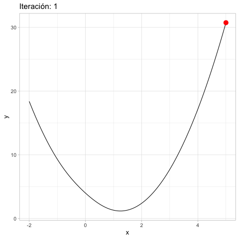
```

<!-- -->


### Selección de tamaño de paso $\eta$

Si hacemos $\eta$ muy chico, el algoritmo puede tardar mucho en
converger:

```r
z <- descenso(20, 5, 0.01, h_deriv)
curve(h, -3, 6)
points(z, h(z))
text(z[1:6], h(z[1:6]), pos = 3)
```


Si hacemos $\eta$ muy grande, el algoritmo puede divergir:


```r
z <- descenso(20, 5, 1.5, h_deriv)
z
```

```
##                [,1]
##  [1,]  5.000000e+00
##  [2,] -1.842308e+01
##  [3,]  9.795302e+01
##  [4,] -4.837345e+02
##  [5,]  2.424666e+03
##  [6,] -1.211733e+04
##  [7,]  6.059265e+04
##  [8,] -3.029573e+05
##  [9,]  1.514792e+06
## [10,] -7.573955e+06
## [11,]  3.786978e+07
## [12,] -1.893489e+08
## [13,]  9.467445e+08
## [14,] -4.733723e+09
## [15,]  2.366861e+10
## [16,] -1.183431e+11
## [17,]  5.917153e+11
## [18,] -2.958577e+12
## [19,]  1.479288e+13
## [20,] -7.396442e+13
```

<div class="comentario">
<p>Es necesario ajustar el tamaño de paso para cada problema particular. Si la convergencia es muy lenta, podemos incrementarlo. Si las iteraciones divergen, podemos disminuirlo</p>
</div>

### Funciones de varias variables
Si ahora $h(z)$ es una función de $p$ variables, podemos intentar
la misma idea usando el gradiente. Por cálculo sabemos que el gradiente
apunta en la dirección de máximo crecimiento local. El gradiente es
el vector columna con las derivadas parciales de $h$:

$$\nabla h(z) = \left( \frac{\partial h}{\partial z_1}, \frac{\partial h}{\partial z_2}, \ldots,    \frac{\partial h}{\partial z_p} \right)^t$$
Y el paso de iteración, dado un valor inicial $z_0$ y un tamaño de paso
$\eta >0$ es

$$z^{(i+1)} = z^{(i)} - \eta \nabla h(z^{(i)})$$

Las mismas consideraciones acerca del tamaño de paso $\eta$ aplican en
el problema multivariado.


```r
h <- function(z) {
  z[1]^2 + z[2]^2 - z[1] * z[2]
}
h_gr <- function(z_1,z_2) apply(cbind(z_1, z_2), 1, h)
grid_graf <- expand.grid(z_1 = seq(-3, 3, 0.1), z_2 = seq(-3, 3, 0.1))
grid_graf <- grid_graf %>%  mutate( val = apply(cbind(z_1,z_2), 1, h))
gr_contour <- ggplot(grid_graf, aes(x = z_1, y = z_2, z = val)) + 
  geom_contour(binwidth = 1.5, aes(colour = ..level..))
gr_contour
```

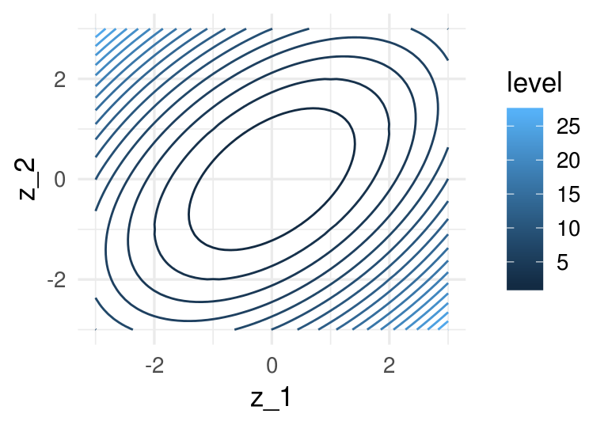

El gradiente está dado por


```r
h_grad <- function(z){
  c(2*z[1] - z[2], 2*z[2] - z[1])
}
```

Podemos graficar la dirección de máximo descenso para diversos puntos. Estas
direcciones son ortogonales a la curva de nivel que pasa por cada uno de los
puntos:


```r
grad_1 <- h_grad(c(0,-2))
grad_2 <- h_grad(c(1,1))
eta <- 0.2
gr_contour +
  geom_segment(aes(x=0.0, xend=0.0-eta*grad_1[1], y=-2,
     yend=-2-eta*grad_1[2]),
    arrow = arrow(length = unit(0.2,"cm")))+ 
  geom_segment(aes(x=1, xend=1-eta*grad_2[1], y=1,
     yend=1-eta*grad_2[2]),
    arrow = arrow(length = unit(0.2,"cm")))+ coord_fixed(ratio = 1)
```

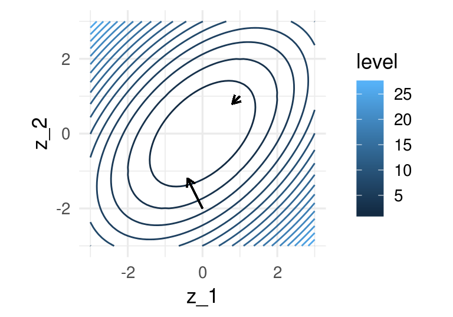

Y aplicamos descenso en gradiente:


```r
inicial <- c(3, 1)
iteraciones <- descenso(20, inicial , 0.1, h_grad)
df_iteraciones <- data.frame(iteraciones) %>%
    mutate(iteracion = 1:nrow(iteraciones))
graf_descenso_2 <- ggplot(data = df_iteraciones) + 
  geom_contour(data= grid_graf, binwidth = 1.5, 
    aes(x = z_1, y = z_2, z = val, colour = ..level..)) + 
   geom_point(aes(x=X1, y=X2), colour = 'red')
if(FALSE){
    library(gganimate)
    graf_descenso_2 + 
        labs(title = 'Iteración: {frame_time}') +
        transition_time(iteracion)
    anim_save(filename = "figuras/descenso_2.gif")
}
knitr::include_graphics("figuras/descenso_2.gif")
```

<!-- -->


## Descenso en gradiente para regresión lineal

Vamos a escribir ahora el algoritmo de descenso en gradiente para regresión lineal.
Igual que en los ejemplos anteriores, tenemos que precalcular el gradiente. Una
vez que esto esté terminado, escribir la iteración es fácil.

Recordamos que queremos minimizar (dividiendo entre dos para simplificar más adelante)
$$RSS(\beta) = \frac{1}{2}\sum_{i=1}^N (y^{(i)} - f_\beta(x^{(i)}))^2$$

La derivada de la suma es la suma de las derivadas, así nos concentramos
en derivar uno de los términos

$$  u^{(i)}=\frac{1}{2}(y^{(i)} - f_\beta(x^{(i)}))^2 $$
Usamos la regla de la cadena para obtener
$$ \frac{1}{2}\frac{\partial}{\partial \beta_j} (y^{(i)} - f_\beta(x^{(i)}))^2 =
-(y^{(i)} - f_\beta(x^{(i)})) \frac{\partial f_\beta(x^{(i)})}{\partial \beta_j}$$

Ahora recordamos que
$$f_{\beta} (x) = \beta_0 + \beta_1 x_1 + \beta_2 x_2 + \cdots + \beta_p x_p$$

Y vemos que tenemos dos casos. Si $j=0$,

$$\frac{\partial f_\beta(x^{(i)})}{\partial \beta_0} = 1$$
y  si $j=1,2,\ldots, p$ entonces

$$\frac{\partial f_\beta(x^{(i)})}{\partial \beta_j} = x_j^{(i)}$$

Entonces, si ponemos $  u^{(i)}=\frac{1}{2}(y^{(i)} - f_\beta(x^{(i)}))^2 $:


$$\frac{\partial u^{(i)}}{\partial \beta_0} = -(y^{(i)} - f_\beta(x^{(i)}))$$
y 

$$\frac{\partial u^{(i)}}{\partial \beta_j} = - x_j^{(i)}(y^{(i)} - f_\beta(x^{(i)}))$$


Y sumando todos los términos (uno para cada caso de entrenamiento):


**Gradiente para regresión lineal**

Sea $e^{(i)} =  y_{(i)} - f_{\beta} (x^{(i)})$. Entonces

\begin{equation}
  \frac{\partial RSS(\beta)}{\partial \beta_0} = - \sum_{i=1}^N e^{(i)} 
  (\#eq:grad1)
\end{equation}


\begin{equation}
  \frac{\partial RSS(\beta)}{\partial \beta_j} = - \sum_{i=1}^N x_j^{(i)}e^{(i)} 
  (\#eq:grad2)
\end{equation}
para $j=1,2,\ldots, p$. 


Nótese que cada punto de entrenamiento contribuye
al cálculo del gradiente - la contribución es la dirección de descenso de error
para ese punto particular de entrenamiento. Nos movemos entonces en una dirección
promedio, para intentar hacer el error total lo más chico posible.

Podemos implementar ahora estos cálculos. Aunque podríamos escribir
ciclos para hacer estos cálculos, es mejor hacer los cálculos 
en forma matricial, de manera que aprovechamos rutinas de álgebra lineal
eficiente. El cálculo del gradiente es como sigue:


```r
grad_calc <- function(x_ent, y_ent){
  salida_grad <- function(beta){
    f_beta <- as.matrix(cbind(1, x_ent)) %*% beta
    e <- y_ent - f_beta
    grad_out <- -as.numeric(t(cbind(1, x_ent)) %*% e)
    names(grad_out) <- c('Intercept', colnames(x_ent))
    grad_out
  }
  salida_grad
}
grad_prostata <- grad_calc(prostata_entrena[, 1, drop = FALSE], prostata_entrena$lpsa)
grad_prostata(c(0,1))
```

```
## Intercept    lcavol 
## -76.30319 -70.93938
```

```r
grad_prostata(c(1,1))
```

```
## Intercept    lcavol 
## -9.303187 17.064556
```

Podemos checar nuestro cálculo del gradiente, por ejemplo:

```r
delta <- 0.001
(rss_prostata(c(1 + delta, 1)) - rss_prostata(c(1, 1))) / delta
```

```
## [1] -9.269687
```

```r
(rss_prostata(c(1, 1 + delta)) - rss_prostata(c(1, 1))) / delta
```

```
## [1] 17.17331
```


Y ahora iteramos para obtener


```r
iteraciones <- descenso(100, c(0,0), 0.005, grad_prostata)
iteraciones
```

```
##             [,1]      [,2]
##   [1,] 0.0000000 0.0000000
##   [2,] 0.8215356 1.4421892
##   [3,] 0.7332652 0.9545169
##   [4,] 0.8891507 1.0360252
##   [5,] 0.9569494 0.9603012
##   [6,] 1.0353555 0.9370937
##   [7,] 1.0977074 0.9046239
##   [8,] 1.1534587 0.8800287
##   [9,] 1.2013557 0.8576489
##  [10,] 1.2430547 0.8385314
##  [11,] 1.2791967 0.8218556
##  [12,] 1.3105688 0.8074114
##  [13,] 1.3377869 0.7948709
##  [14,] 1.3614051 0.7839915
##  [15,] 1.3818983 0.7745509
##  [16,] 1.3996803 0.7663595
##  [17,] 1.4151098 0.7592518
##  [18,] 1.4284979 0.7530844
##  [19,] 1.4401148 0.7477329
##  [20,] 1.4501947 0.7430895
##  [21,] 1.4589411 0.7390604
##  [22,] 1.4665303 0.7355643
##  [23,] 1.4731155 0.7325308
##  [24,] 1.4788295 0.7298986
##  [25,] 1.4837875 0.7276146
##  [26,] 1.4880895 0.7256328
##  [27,] 1.4918224 0.7239132
##  [28,] 1.4950614 0.7224211
##  [29,] 1.4978719 0.7211265
##  [30,] 1.5003106 0.7200031
##  [31,] 1.5024267 0.7190283
##  [32,] 1.5042627 0.7181825
##  [33,] 1.5058559 0.7174486
##  [34,] 1.5072383 0.7168117
##  [35,] 1.5084378 0.7162592
##  [36,] 1.5094786 0.7157797
##  [37,] 1.5103817 0.7153637
##  [38,] 1.5111654 0.7150027
##  [39,] 1.5118453 0.7146895
##  [40,] 1.5124353 0.7144177
##  [41,] 1.5129473 0.7141819
##  [42,] 1.5133915 0.7139772
##  [43,] 1.5137769 0.7137997
##  [44,] 1.5141114 0.7136456
##  [45,] 1.5144016 0.7135119
##  [46,] 1.5146534 0.7133959
##  [47,] 1.5148718 0.7132953
##  [48,] 1.5150614 0.7132079
##  [49,] 1.5152259 0.7131322
##  [50,] 1.5153687 0.7130664
##  [51,] 1.5154925 0.7130093
##  [52,] 1.5156000 0.7129598
##  [53,] 1.5156933 0.7129169
##  [54,] 1.5157742 0.7128796
##  [55,] 1.5158444 0.7128473
##  [56,] 1.5159053 0.7128192
##  [57,] 1.5159582 0.7127948
##  [58,] 1.5160040 0.7127737
##  [59,] 1.5160438 0.7127554
##  [60,] 1.5160784 0.7127395
##  [61,] 1.5161083 0.7127257
##  [62,] 1.5161343 0.7127137
##  [63,] 1.5161569 0.7127033
##  [64,] 1.5161765 0.7126943
##  [65,] 1.5161934 0.7126865
##  [66,] 1.5162082 0.7126797
##  [67,] 1.5162210 0.7126738
##  [68,] 1.5162321 0.7126687
##  [69,] 1.5162417 0.7126642
##  [70,] 1.5162501 0.7126604
##  [71,] 1.5162573 0.7126570
##  [72,] 1.5162636 0.7126541
##  [73,] 1.5162690 0.7126516
##  [74,] 1.5162738 0.7126495
##  [75,] 1.5162779 0.7126476
##  [76,] 1.5162815 0.7126459
##  [77,] 1.5162846 0.7126445
##  [78,] 1.5162872 0.7126433
##  [79,] 1.5162896 0.7126422
##  [80,] 1.5162916 0.7126412
##  [81,] 1.5162933 0.7126404
##  [82,] 1.5162949 0.7126397
##  [83,] 1.5162962 0.7126391
##  [84,] 1.5162973 0.7126386
##  [85,] 1.5162983 0.7126381
##  [86,] 1.5162992 0.7126377
##  [87,] 1.5162999 0.7126374
##  [88,] 1.5163006 0.7126371
##  [89,] 1.5163012 0.7126368
##  [90,] 1.5163016 0.7126366
##  [91,] 1.5163021 0.7126364
##  [92,] 1.5163024 0.7126363
##  [93,] 1.5163028 0.7126361
##  [94,] 1.5163030 0.7126360
##  [95,] 1.5163033 0.7126359
##  [96,] 1.5163035 0.7126358
##  [97,] 1.5163037 0.7126357
##  [98,] 1.5163038 0.7126356
##  [99,] 1.5163040 0.7126356
## [100,] 1.5163041 0.7126355
```

Y checamos que efectivamente el error total de entrenamiento decrece

```r
apply(iteraciones, 1, rss_prostata)
```

```
##   [1] 249.60960  51.70986  32.49921  28.96515  27.22475  25.99191  25.07023
##   [8]  24.37684  23.85483  23.46181  23.16591  22.94312  22.77538  22.64910
##  [15]  22.55401  22.48242  22.42852  22.38794  22.35739  22.33438  22.31706
##  [22]  22.30402  22.29421  22.28681  22.28125  22.27706  22.27390  22.27153
##  [29]  22.26974  22.26839  22.26738  22.26662  22.26604  22.26561  22.26528
##  [36]  22.26504  22.26485  22.26471  22.26461  22.26453  22.26447  22.26443
##  [43]  22.26439  22.26437  22.26435  22.26434  22.26432  22.26432  22.26431
##  [50]  22.26431  22.26430  22.26430  22.26430  22.26430  22.26429  22.26429
##  [57]  22.26429  22.26429  22.26429  22.26429  22.26429  22.26429  22.26429
##  [64]  22.26429  22.26429  22.26429  22.26429  22.26429  22.26429  22.26429
##  [71]  22.26429  22.26429  22.26429  22.26429  22.26429  22.26429  22.26429
##  [78]  22.26429  22.26429  22.26429  22.26429  22.26429  22.26429  22.26429
##  [85]  22.26429  22.26429  22.26429  22.26429  22.26429  22.26429  22.26429
##  [92]  22.26429  22.26429  22.26429  22.26429  22.26429  22.26429  22.26429
##  [99]  22.26429  22.26429
```

Verificamos el gradiente, que si convergió al mínimo debe ser muy
cercano a 0:


```r
grad_prostata(iteraciones[100, ])
```

```
##     Intercept        lcavol 
## -2.053148e-05  9.458051e-06
```


#### Notación y forma matricial {-}

Usando la notación de la clase anterior (agregando una columna de unos al principio):

$$\underline{X} =  \left ( \begin{array}{ccccc}
1 & x_1^{(1)} & x_2^{(1)} & \ldots  & x_p^{(1)} \\
1 & x_1^{(2)} & x_2^{(2)} & \ldots  & x_p^{(2)}\\
1& \vdots & \vdots &   &  \vdots \\
1 & x_1^{(N)} & x_2^{(N)} & \ldots  & x_p^{(N)} \\
 \end{array} \right)$$

y $$\underline{y} =(y^{(1)},y^{(2)}, \ldots, y^{(N)})^t.$$

Como
$$\underline{e} = \underline{y} - \underline{X}\beta$$

tenemos entonces (de las fórmulas \@ref(eq:grad1) y \@ref(eq:grad2)):
\begin{equation}
\nabla RSS(\beta) =   \underline{X}^t(\underline{X}\beta - \underline{y}) =  -\underline{X}^t \underline{e}
(\#eq:gradmat)
\end{equation}


## Normalización de entradas

La convergencia de descenso en gradiente (y también el desempeño numérico
para otros algoritmos) puede dificultarse cuando las variables tienen escalas
muy diferentes. Esto produce curvaturas altas en la función que queremos
minimizar.

En este ejemplo simple, una variable tiene desviación estándar
10 y otra 1:


```r
x1 <- rnorm(100, 0, 5) 
x2 <- rnorm(100, 0, 1) +  0.1*x1
y <- 0*x1 + 0*x2 + rnorm(100, 0, 0.1) 
dat <- data_frame(x1, x2,  y)
rss <- function(beta)  mean((as.matrix(dat[, 1:2]) %*% beta - y)^2) 
grid_beta <- expand.grid(beta1 = seq(-1, 1, length.out = 50), 
                         beta2 = seq(-1, 1, length.out = 50))
rss_1 <- apply(grid_beta, 1, rss) 
dat_x <- data.frame(grid_beta, rss_1)
ggplot(dat_x, aes(x = beta1, y = beta2, z = rss_1)) + 
    geom_contour(binwidth = 0.5) +
    coord_equal() 
```

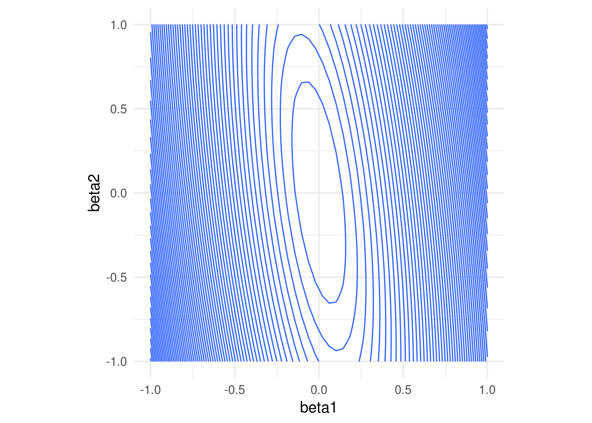

En algunas direcciones el gradiente es muy grande, y en otras chico. 
Esto implica que la convergencia puede ser muy lenta en algunas direcciones,
puede diverger en otras, 
y que hay que ajustar el paso $\eta > 0$ con cuidado, 
dependiendo de dónde comiencen las iteraciones.

Por ejemplo, con un tamaño de paso relativamente chico, damos unos saltos
grandes al principio y luego avanzamos muy lentamente:


```r
grad_sin_norm <- grad_calc(dat[, 1:2, drop = FALSE], dat$y)
iteraciones <- descenso(10, c(0, -0.25, -0.75), 0.0001, grad_sin_norm)
ggplot(dat_x) + 
    geom_contour(aes(x = beta1, y = beta2, z = rss_1), binwidth = 0.5) +
    coord_equal() +
  geom_path(data = data.frame(iteraciones[, 2:3]), aes(x=X1, y=X2), colour = 'red') +
  geom_point(data = data.frame(iteraciones[, 2:3]), aes(x=X1, y=X2), colour = 'red')
```

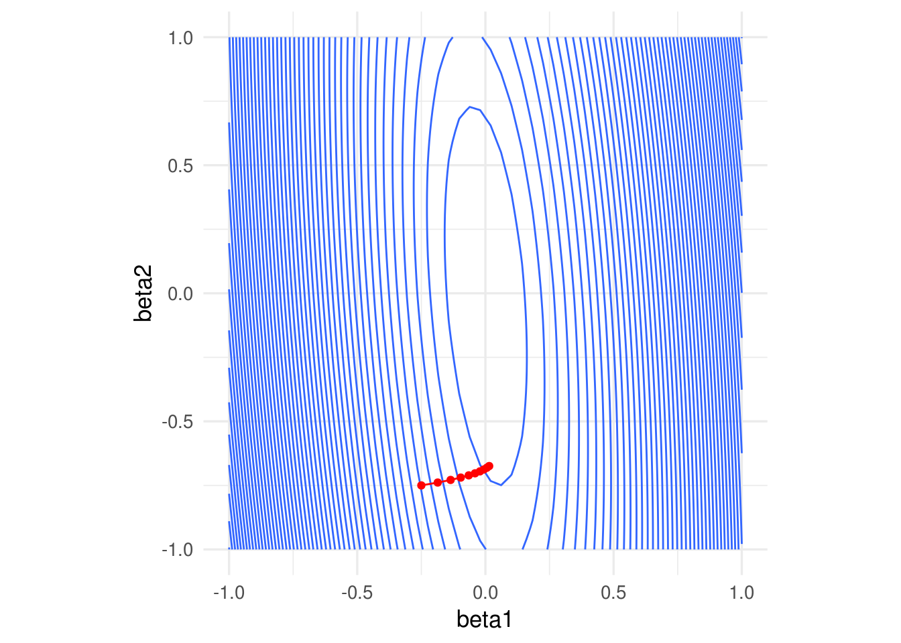

Si incrementamos el tamaño de paso observamos también convergencia lenta. En este
caso particular, subir más el tamaño de paso produce divergencia:


```r
iteraciones <- descenso(10, c(0, -0.25, -0.75), 0.0007, grad_sin_norm)
ggplot(dat_x) + 
    geom_contour(aes(x = beta1, y = beta2, z = rss_1), binwidth = 0.5) +
    coord_equal() +
  geom_path(data = data.frame(iteraciones[, 2:3]), aes(x=X1, y=X2), colour = 'red') +
  geom_point(data = data.frame(iteraciones[, 2:3]), aes(x=X1, y=X2), colour = 'red')
```

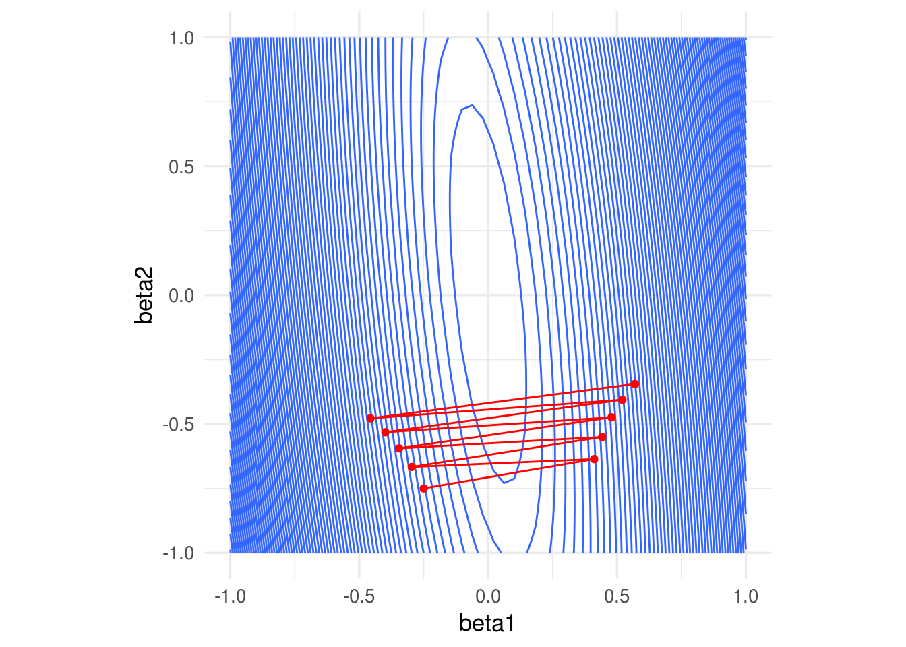

Una normalización usual es con la media y desviación estándar, donde hacemos,
para cada variable de entrada $j=1,2,\ldots, p$
$$ x_j^{(i)} = \frac{ x_j^{(i)} - \bar{x}_j}{s_j}$$
donde
$$\bar{x}_j = \frac{1}{N} \sum_{i=1}^N x_j^{(i)}$$
$$s_j = \sqrt{\frac{1}{N-1}\sum_{i=1}^N (x_j^{(i)}- \bar{x}_j )^2}$$
es decir, centramos y normalizamos por columna. Otra opción común es restar
el mínimo y dividir entre la diferencia del máximo y el mínimo, de modo
que las variables resultantes toman valores en $[0,1]$.


Entonces escalamos antes de ajustar:


```r
x1_s = (x1 - mean(x1))/sd(x1)
x2_s = (x2 - mean(x2))/sd(x2)
dat <- data_frame(x1_s, x2_s,  y)
rss <- function(beta)  mean((as.matrix(dat[, 1:2]) %*% beta - y)^2) 
grid_beta <- expand.grid(beta1 = seq(-1, 1, length.out = 50), 
                         beta2 = seq(-1, 1, length.out = 50))
rss_1 <- apply(grid_beta, 1, rss) 
dat_x <- data.frame(grid_beta, rss_1)
ggplot(dat_x, aes(x = beta1, y = beta2, z = rss_1)) + 
    geom_contour(binwidth = 0.5) +
    coord_equal() 
```

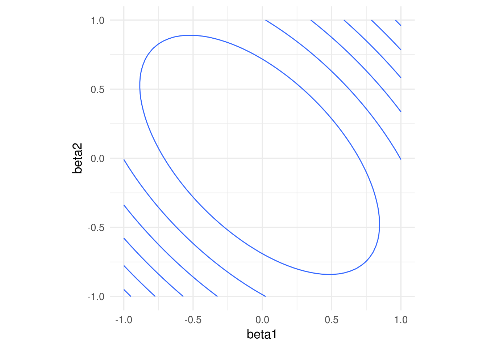

Nótese que los coeficientes ajustados serán diferentes a los del caso no
normalizado. 

Si normalizamos, obtenemos convergencia más rápida


```r
grad_sin_norm <- grad_calc(dat[, 1:2, drop = FALSE], dat$y)
iteraciones <- descenso(10, c(0, -0.25, -0.75), 0.005, grad_sin_norm)
ggplot(dat_x) + 
    geom_contour(aes(x = beta1, y = beta2, z = rss_1), binwidth = 0.5) +
    coord_equal() +
  geom_path(data = data.frame(iteraciones[, 2:3]), aes(x=X1, y=X2), colour = 'red') +
  geom_point(data = data.frame(iteraciones[, 2:3]), aes(x=X1, y=X2), colour = 'red')
```

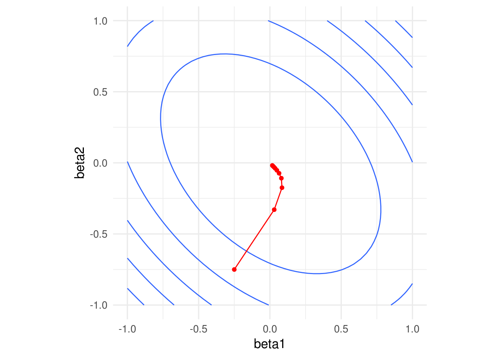


<div class="comment">
<p>Cuando normalizamos antes de ajustar el modelo, las predicciones deben hacerse con entradas normalizadas. La normalización se hace con los mismos valores que se usaron en el entrenamiento (y <strong>no</strong> recalculando medias y desviaciones estándar con el conjunto de prueba).</p>
<p>En cuanto a la forma funcional del predictor <span class="math inline">\(f\)</span>, el problema con entradas normalizadas es equivalente al de las entradas no normalizadas. Asegúrate de esto escribiendo cómo correponden los coeficientes de cada modelo normalizado con los coeficientes del modelo no normalizado.</p>
</div>

Supongamos que el modelo en las variables originales  es
$${f}_\beta (X) = \beta_0 + \beta_1 X_1 + \beta_2 X_2 + \cdots + \beta_p X_p,$$
Consideramos el modelo con variables estandarizadas
$${g}_\beta (X) = \beta_0^s + \beta_1^s Z_1 + \beta_2^s Z_2 + \cdots + \beta_p^s Z_p,$$

Sustituyendo $Z_j = (X_j - \mu_j)/s_j,$ 

$${g}_{\beta^s} (X) = (\beta_0^s - \sum_{j=1}^p \mu_j/s_j) + \frac{\beta_1^s}{s_j} X_1 + \frac{\beta_2^s}{s_2} X_2 + \cdots + \frac{\beta_p^s}{s_p} X_p,$$
Y vemos que tiene la misma forma funcional de $f_\beta(X)$. Si la solución de mínimos cuadrados es única,
entonces una vez que ajustemos tenemos que tener $\hat{f}_\beta(X) = \hat{g}_{\beta^s} (X)$,
lo que implica que
$$\hat{\beta}_0 = \hat{\beta}_0^s -  \sum_{j=1}^p \mu_j/s_j)$$ y
$$\hat{\beta}_j = \hat{\beta}_j^s/s_j.$$

Nótese que para pasar del problema estandarizado al no estandarizado simplemente
se requiere escalar los coeficientes por la $s_j$ correspondiente.

## Interpretación de modelos lineales

Muchas veces se considera que la facilidad de interpretación es una fortaleza
del modelo lineal. Esto es en parte cierto, pero hay algunas consideraciones
importantes que debemos tomar en cuenta.

La interpretación más sólida es la de las predicciones: podemos decir
por qué una predicción es alta o baja.

Consideremos el ejemplo de cáncer de prostata, por ejemplo:


```r
library(tidyr)
prostate_completo <- read_csv(file = 'datos/prostate.csv')
pr_entrena <- filter(prostate_completo, train) 
pr_entrena <- pr_entrena %>% mutate(id = 1:nrow(pr_entrena))
#normalizamos
pr_entrena_s <- 
  pr_entrena %>% 
  select(id, lcavol, age, lpsa) %>%
  gather(variable, valor, lcavol:age) %>%
  group_by(variable) %>%
  mutate(media = mean(valor), desv = sd(valor)) %>%
  mutate(valor_s = (valor - media)/desv) 

pr_modelo <- pr_entrena_s %>% select(id, lpsa, variable, valor_s) %>%
  spread(variable, valor_s)

mod_pr <- lm( lpsa ~ lcavol  + age , data = pr_modelo )
round(coefficients(mod_pr), 2)
```

```
## (Intercept)      lcavol         age 
##        2.45        0.88        0.02
```

y observamos el rango de $lpsa$:

```r
round(summary(pr_modelo$lpsa), 2)
```

```
##    Min. 1st Qu.  Median    Mean 3rd Qu.    Max. 
##   -0.43    1.67    2.57    2.45    3.37    5.48
```

Ahora podemos interpretar el predictor:

- Cuando las variables lcavol y age están en sus media, la predicción de lpsa
  es 2.5
- Si lcavol sube 1 desviación estándar por encima de la media, el predictor de lpsa
sube alrededor de 0.9 unidades (de un rango de alrededor de 6 unidades)
- Si age sube 1 desviación estándar por encima de su media, el predictor de lpsa
sube 0.02, lo cual es un movimiento muy chico considerando la variación de lpsa.


Así podemos explicar cada predicción - considerando qué variables aportan positiva y cuáles
negativamente a la predicción. **El camino más seguro es limitarse a hacer este
tipo de análisis de las predicciones**. Hablamos de entender la estructura predictiva
del problema con los datos que tenemos - y no intentamos ir hacia la explicación
del fenómeno.

Cualquier otra interpretación requiere mucho más cuidados, y requiere
una revisión de la especificación correcta del modelo. Parte de estos
cuidados se estudian en un curso de regresión desde el punto de vista
estadístico, por ejemplo:

- La interpretación coeficiente a coeficiente no toma en cuenta la estructura
de asociación de las $x's$. Rara vez *cambios marginales* en una variable 
de entrada ocurren
de manera independiente de las otras variables de entrada.

- Variación muestral. Es necesario considerar la variación en nuestras estimaciones
de los coeficientes para poder concluir acerca de su relación con el fenómeno 
(tratable desde punto de vista estadístico, pero hay que checar supuestos). 
Quizá el error de estimación del
coeficiente de lcavol es 2 veces su magnitud - difícilmente podemos concluir 
algo acerca la relación de lcavol.

- Efectos no lineales: si la estructura del problema es altamente no lineal,
los coeficientes de un modelo lineal no tienen una interpretación clara en relación 
al fenómeno. Esto también
es parcialmente tratable con diagnósticos.


```r
set.seed(2112)
x <- rnorm(20)
y <- x^2
summary(lm(y ~x))
```

```
## 
## Call:
## lm(formula = y ~ x)
## 
## Residuals:
##     Min      1Q  Median      3Q     Max 
## -0.7462 -0.5022 -0.3313  0.3435  1.6273 
## 
## Coefficients:
##             Estimate Std. Error t value Pr(>|t|)    
## (Intercept)  0.85344    0.17570   4.857 0.000127 ***
## x            0.04117    0.18890   0.218 0.829929    
## ---
## Signif. codes:  0 '***' 0.001 '**' 0.01 '*' 0.05 '.' 0.1 ' ' 1
## 
## Residual standard error: 0.7484 on 18 degrees of freedom
## Multiple R-squared:  0.002632,	Adjusted R-squared:  -0.05278 
## F-statistic: 0.0475 on 1 and 18 DF,  p-value: 0.8299
```

Otros cuidados adicionales se requieren si queremos hacer afirmaciones causales:

- Variables omitidas: si faltan algunas variables cruciales en el fenómeno que nos
interesa, puede ser muy difícil interpretar el resto de los coeficientes en términos 
del fenómeno

#### Ejemplo: {-}

- Supongamos que queremos predecir cuánto van a gastar en televisiones samsung ciertas
personas que llegan a Amazon. Una variable de entrada es el número de
anuncios de televisiones Samsung que recibieron antes de llegar a Amazon.
El coeficiente de esta variable es alto (significativo, etc.),
así que concluimos que el anuncio causa compras de  televisiones Samsung.

¿Qué está mal aquí? El modelo no está mal, sino la interpretación y la conclusión 
de causalidad. Cuando las
personas están investigando acerca de televisiones, reciben anuncios. La razón
es que esta variable nos puede indicar más bien quién está en proceso de compra
de una televisión samsung (reciben anuncios) y quién no (no hacen búsquedas
relevantes, así que no reciben anuncios). El modelo está mal especificado porque
no consideramos que hay otra variable importante, que es el interés de la
persona en compra de TVs Samsung.

En general, la recomendación es que las interpretaciones causales deben considerarse
como preliminares (o *sugerencias*), y se requiere más análisis y consideraciones
antes de poder tener interpretaciones causales sólidas. 

#### Ejercicio {-}

En el siguiente ejercicio intentamos predecir el porcentaje de grasa corporal 
(una medición relativamente cara) usando mediciones de varias partes del cuerpo,
edad, peso y estatura. Ver script *ejercicios/bodyfat_ejercicio.R*


```r
library(tidyr)
dat_grasa <- read_csv(file = 'datos/bodyfat.csv')
head(dat_grasa)
```

```
## # A tibble: 6 x 14
##   grasacorp  edad  peso estatura cuello pecho abdomen cadera muslo rodilla
##       <dbl> <int> <dbl>    <dbl>  <dbl> <dbl>   <dbl>  <dbl> <dbl>   <dbl>
## 1      12.3    23  154.     67.8   36.2  93.1    85.2   94.5  59      37.3
## 2       6.1    22  173.     72.2   38.5  93.6    83     98.7  58.7    37.3
## 3      25.3    22  154      66.2   34    95.8    87.9   99.2  59.6    38.9
## 4      10.4    26  185.     72.2   37.4 102.     86.4  101.   60.1    37.3
## 5      28.7    24  184.     71.2   34.4  97.3   100    102.   63.2    42.2
## 6      20.9    24  210.     74.8   39   104.     94.4  108.   66      42  
## # ... with 4 more variables: tobillo <dbl>, biceps <dbl>, antebrazo <dbl>,
## #   muñeca <dbl>
```

```r
nrow(dat_grasa)
```

```
## [1] 252
```


## Solución analítica

El problema de mínimos cuadrados tiene una solución de forma cerrada. A partir
del gradiente \@ref(eq:gradmat), podemos igual a cero y resolver (chécalo) para
obtener:

\begin{equation*}
\hat{\beta} = \left (\underline{X}\underline{X}^t \right)^{-1}
\underline{X}^t\underline{y}
\end{equation*}

Paquetes como *lm* de R usan como base esta expresión, pero los cálculos se
hacen mediante descomposiciones matriciales para más estabilidad (productos
de matrices e inversiones). Aunque es posible escalar y/o paralelizar estos
cálculos matriciales para problemas grandes, los procedimientos son más
delicados. Nuestro enfoque de descenso máximo tiene la ventaja de que
es fácil de entender, usar, aplicar a otros problemas con éxito,
y además puede escalarse trivialmente, como veremos
más adelante (por ejemplo, descenso estocástico). ¡Aunque siempre que se pueda
es buena idea usar *lm*!


## ¿Por qué el modelo lineal funciona bien (muchas veces)?

Regresión lineal es un método muy simple, 
y parecería que debería haber métodos más avanzados que lo superen fácilmente.

Para empezar, es poco creíble que el modelo
$$f(X) = b_0 + b_1X_1 + \cdots b_p X_p$$
se cumple exactamente para el fenómeno que estamos tratando. Pero regresión lineal muchas veces supera a métodos que intentan
construir predictores más complejos. 
Una de las primeras razones es que podemos ver la aproximación lineal como una aproximación de primer orden a la verdadera $f(X)$, y muchas veces eso es suficiente para producir predicciones razonables.

Adicionalmente, otras veces sólo tenemos suficientes datos para hacer una aproximación de primer orden, aún cuando la verdadera
$f(X)$ no sea lineal, y resulta que esta aproximación da buenos resultados. Esto es particularmente cierto en problemas de dimensión alta, como veremos a continuación.


### k vecinos más cercanos

Un método popular, con buen desempeño en varios ejemplos, 
es el de k-vecinos más cercanos, 
que consiste en hacer aproximaciones locales directas de $f(X)$.
Sea ${\mathcal L}$  un conjunto de entrenamiento. Para $k$ entera fija, y 
$x_0$ una entrada donde queremos predecir, definimos a $N_k(x_0)$ como el conjunto de los $k$ elementos
de ${\mathcal L}$ que tienen $x^{(i)}$ más cercana a $x_0$. Hacemos la predicción
$$\hat{f}(x_0) = \frac{1}{k}\sum_{x^{(i)} \in N_k(x_0)} y^{(i)}$$

Es decir, promediamos las $k$ $y$'s con $x$'s más cercanas a donde queremos predecir.


#### Ejemplo {-}


```r
library(ISLR)
datos <- Auto[, c('name', 'weight','year', 'mpg')]
datos$peso_kg <- datos$weight*0.45359237
datos$rendimiento_kpl <- datos$mpg*(1.609344/3.78541178)
nrow(datos)
```

```
## [1] 392
```

Vamos a separa en muestra de entrenamiento y de prueba estos datos. Podemos
hacerlo como sigue (2/3 para entrenamiento aproximadamente en este caso, así
obtenemos alrededor de 100 casos para prueba):


```r
set.seed(213)
datos$muestra_unif <- runif(nrow(datos), 0, 1)
datos_entrena <- filter(datos, muestra_unif > 1/3)
datos_prueba <- filter(datos, muestra_unif <= 1/3)
nrow(datos_entrena)
```

```
## [1] 274
```

```r
nrow(datos_prueba)
```

```
## [1] 118
```


```r
ggplot(datos_entrena, aes(x = peso_kg, y = rendimiento_kpl)) +
  geom_point()
```


Consideremos un modelo de $k=15$ vecinos más cercanos. La función de predicción
ajustada es entonces:


```r
library(kknn)
# nótese que no normalizamos entradas - esto también es importante
# hacer cuando hacemos vecinos más cercanos, pues en otro caso
# las variables con escalas más grandes dominan el cálculo
mod_15vmc <- kknn(rendimiento_kpl ~ peso_kg, train = datos_entrena,
                  test = data_frame(peso_kg=seq(700,2200, by = 10)), 
                  k=15)
dat_graf <- data_frame(peso_kg = seq(700,2200, by = 10), 
                       rendimiento_kpl = predict(mod_15vmc))
ggplot(datos_entrena, aes(x = peso_kg, y = rendimiento_kpl)) +
  geom_point(alpha=0.6) + 
  geom_line(data=dat_graf, col='red', size = 1.2)
```

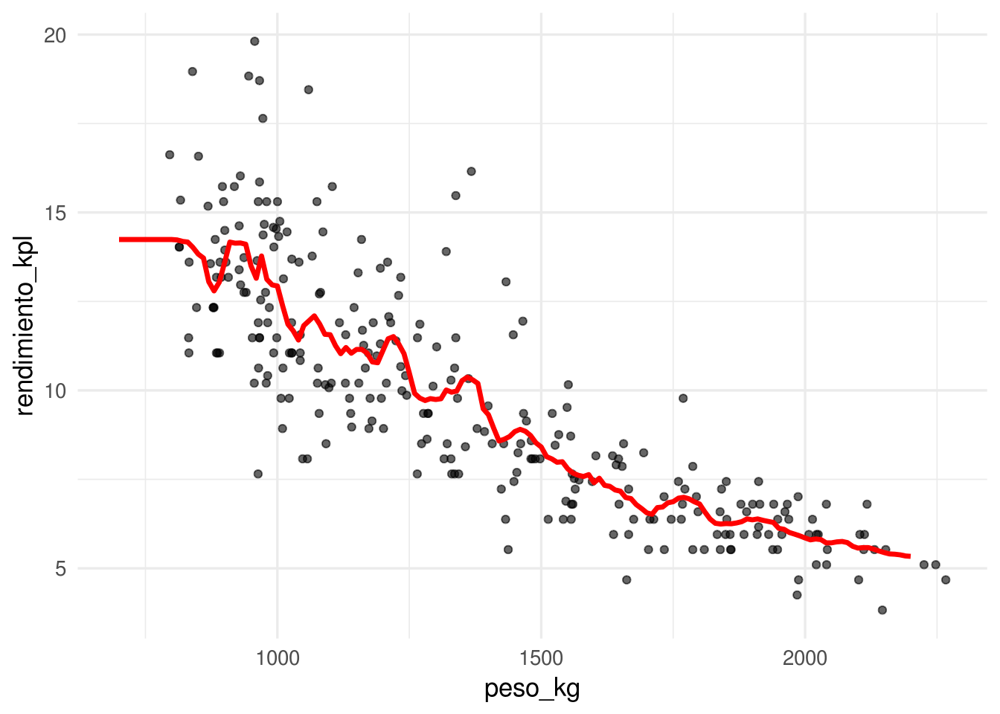

Y para $k=5$ vecinos más cercanos:


```r
mod_5vmc <- kknn(rendimiento_kpl ~ peso_kg, train = datos_entrena,
                  test = data_frame(peso_kg=seq(700,2200, by = 10)), 
                  k = 5)
dat_graf <- data_frame(peso_kg = seq(700,2200, by = 10), 
                       rendimiento_kpl = predict(mod_5vmc))
ggplot(datos_entrena, aes(x = peso_kg, y = rendimiento_kpl)) +
  geom_point(alpha=0.6) + 
  geom_line(data=dat_graf, col='red', size = 1.2)
```

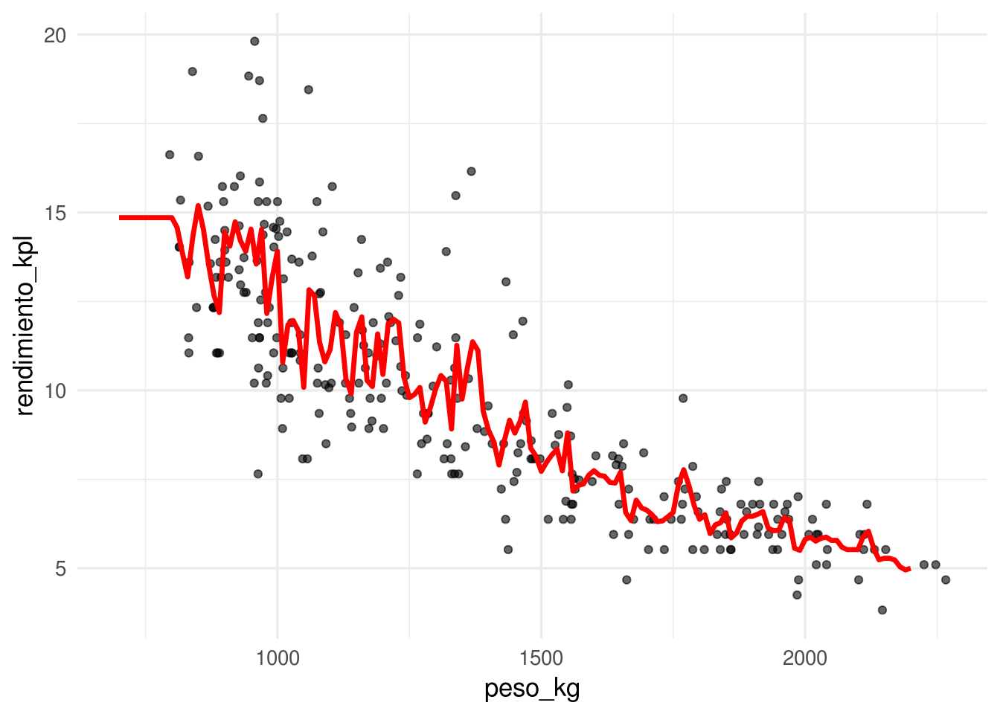

En nuestro caso, los errores de prueba son


```r
mod_3vmc <- kknn(rendimiento_kpl ~ peso_kg, train = datos_entrena,
                  test = datos_prueba, 
                  k = 3)
mod_15vmc <- kknn(rendimiento_kpl ~ peso_kg, train = datos_entrena,
                  test = datos_prueba, 
                  k = 15)
(mean((datos_prueba$rendimiento_kpl-predict(mod_3vmc))^2))
```

```
## [1] 3.346934
```

```r
(mean((datos_prueba$rendimiento_kpl-predict(mod_15vmc))^2))
```

```
## [1] 2.697658
```

Pregunta: ¿Cómo escogerías una $k$ adecuada para este problema? Recuerda que adecuada significa que se reduzca a mínimo posible
el error de predicción. Como ejercicio, compara los modelos con
$k = 2, 25, 200$ utilizando una muestra de prueba. ¿Cuál se desempeña mejor? 
Da las razones de el mejor o peor desempeño: recuerda que el desempeño en predicción puede sufrir porque la función estimada no es suficiente flexible para capturar patrones importantes, pero también porque parte del ruido se incorpora en la predicción.

Por los ejemplos anteriores, vemos que k-vecinos más cercanos puede considerarse como un aproximador universal, que puede adaptarse a cualquier patrón importante que haya en los datos. Entonces, ¿cuál es la razón de utilizar otros métodos como regresión? ¿Por qué el desempeño de regresión sería superior?


#### La maldición de la dimensionalidad {-}
El método de k-vecinos más cercanos funciona mejor cuando hay muchas $x$ cercanas a $x0$, de forma que el promedio sea estable (muchas $x$), y extrapolemos poco ($x$ cercanas).
Cuando $k$ es muy chica, nuestras estimaciones son ruidosas, y cuando $k$ es grande y los vecinos están lejos, entonces estamos sesgando la estimación local con datos lejanos a nuestra región de interés.

El problema es que en dimensión alta, casi cualquier conjunto de
entrenamiento (independientemente del tamaño) sufre fuertemente por uno o ambas dificultades del problema.


#### Ejemplo {-}
 Consideremos que la salida Y es determinística $Y = e^{-8\sum_{j=1}^p x_j^2}$.
Vamos a usar 1-vecino más cercano para hacer predicciones, c
on una muestra de entrenamiento de 1000 casos.
Generamos $x^{i}‘s uniformes en $[ 1,1]$, para $p = 2$, y calculamos la respuesta 
$Y$ para cada caso:


```r
fun_exp <- function(x) exp(-8*sum(x^2))
x_1 <- runif(1000, -1, 1)
x_2 <- runif(1000, -1, 1)
dat <- data_frame(x_1 = x_1, x_2 = x_2)
dat$y <- apply(dat, 1, fun_exp)
ggplot(dat, aes(x = x_1, y = x_2, colour = y)) + geom_point()
```

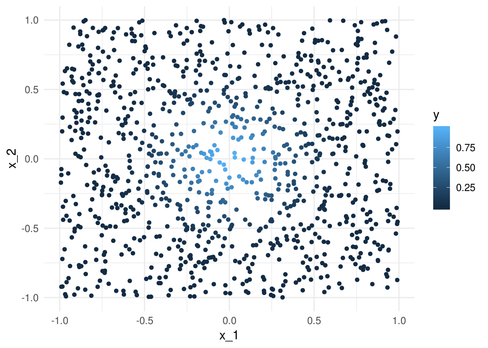

La mejor predicción en $x_0 = (0,0)$ es $f((0,0)) = 1$. Eñ vecino más
cercano al origen es

```r
dist_origen <- apply(dat, 1, function(x) sqrt(sum(head(x, -1)^2)))
mas_cercano_indice <- which.min(dist_origen)
mas_cercano <- dat[mas_cercano_indice, ] 
mas_cercano
```

```
## # A tibble: 1 x 3
##      x_1    x_2     y
##    <dbl>  <dbl> <dbl>
## 1 0.0327 0.0101 0.991
```
Nuestra predicción es entonces $\hat{f}(0)=$ 0.9906871, que
es bastante cercano al valor verdadero (1).

Ahora intentamos hacer lo mismo para dimensión $p=8$.


```r
dat_lista <- lapply(1:8, function(i) runif(1000, -1, 1))
dat <- Reduce(cbind, dat_lista) %>% data.frame
dat$y <- apply(dat, 1, fun_exp)
dist_origen <- apply(dat, 1, function(x) sqrt(sum(head(x, -1)^2)))
mas_cercano_indice <- which.min(dist_origen)
mas_cercano <- dat[mas_cercano_indice, ] 
mas_cercano
```

```
##          init        V2        V3        V4        V5         V6
## 239 0.1612183 0.4117209 0.2546389 -0.226929 0.0774977 0.03897632
##             V7        V8          y
## 239 -0.4959736 0.0382697 0.01073141
```

Y el resultado es un desastre. Nuestra predicción es

```r
mas_cercano$y
```

```
## [1] 0.01073141
```
Necesitariamos una muestra de alrededor de  un millón de casos
para obtener resultados no tan malos (pruébalo).

¿Qué es lo que está pasando? La razón es que en dimensiones altas, 
los puntos de la muestra de entrenamiento están muy lejos 
unos de otros, y están cerca de la frontera, 
incluso para tamaños de muestra relativamente grandes como n = 1000.
Cuando la dimensión crece, la situación empeora exponencialmente.

<div class="comentario">
<p>En dimensiones altas, todos los conjuntos de entrenamiento factibles se distribuyen de manera rala en el espacio de entradas.</p>
</div>

Ahora intentamos algo similar con una función que es razonable aproximar
con una función lineal:


```r
fun_cubica <- function(x) 0.5 * (1 + x[1])^3
```

Y queremos predecir para $x=(0,0,\ldots,0)$, cuyo valor exacto es


```r
fun_cubica(0)
```

```
## [1] 0.5
```

Repetimos el proceso: simulamos las entradas, y aplicamos un vecino más cercano:


```r
set.seed(821)
sims_1 <- lapply(1:40, function(i) runif(1000, -0.5, 0.5) )
dat <- data.frame(Reduce(cbind, sims_1))
dat$y <- apply(dat, 1, fun_cubica)
dist_origen <- apply(dat[, 1:40], 1, function(x) sqrt(sum(x^2)))
mas_cercano_indice <- which.min(dist_origen)
dat$y[mas_cercano_indice]
```

```
## [1] 0.09842398
```

Este no es un resultado muy bueno. Sin embargo, regresión se
desempeña considerablemente mejor:


```r
mod_lineal <- lm(y ~ ., data = dat)
origen <- data.frame(matrix(rep(0,40), 1, 40))
names(origen) <- names(dat)[1:40]
predict(mod_lineal, newdata = origen)
```

```
##         1 
## 0.6251876
```

Donde podemos ver que típicamente la predicción de regresión
es mucho mejor que la de 1 vecino más cercano. Esto es porque el modelo **explota la estructura aproximadamente lineal del problema** (¿cuál estructura lineal? haz algunas gráficas). Nota: corre este ejemplo varias veces con semilla diferente.

Lo que sucede más específicamente es que en regresión lineal
utilizamos **todos** los datos para hacer nuestra estimación en cada
predicción. Si la estructura del problema es aproximadamente lineal, 
entonces regresión lineal explota la estructura para hacer *pooling*
de toda la infromación para construir predicción con sesgo y varianza bajas.

## Tarea {-}

Para este ejemplo usaremos los datos de https://archive.ics.uci.edu/ml/machine-learning-databases/housing/.
El objetivo es predecir el valor mediano de las viviendas en áreas del censo
de Estados Unidos, utilizando variables relacionadas con criminalidad, ambiente,
tipo de viviendas, etc.

- Separa la muestra en dos partes: unos 400 para entrenamiento
y el resto para prueba.
- Describe las variables en la muestra de prueba (rango, media, mediana, por ejemplo). 
- Construye un modelo lineal para predecir MEDV en términos de las otras
variables. Utiliza descenso en gradiente para estimar los coeficientes con los
predictores estandarizados. Verifica tus resultados con la función *lm*. 
- Evalúa el error de entrenamiento $\overline{err}$ de tu modelo, y evalúa
después la estimación del error de predicción $\hat{Err}$ con la muestra de prueba.
Utiliza la raíz del la media de los errores al cuadrado.
- (Adicional) Construye un modelo de 1,5,20 y 50 
vecinos más cercanos, y evalúa su desempeño. ¿Cuál es la mejor $k$ para reducir 
el error de prueba?


