# Métodos basados en árboles: boosting


Boosting también utiliza la idea de un "ensamble" de árboles. La diferencia
grande con
 bagging y bosques aleatorios en que la sucesión de árboles de boosting se 
'adapta' al comportamiento del predictor a lo largo de las iteraciones, 
haciendo reponderaciones de los datos de entrenamiento para que el algoritmo
se concentre en las predicciones más pobres. Boosting generalmente funciona
bien con árboles chicos (cada uno con sesgo alto), mientras que bosques
aleatorios funciona con árboles grandes (sesgo bajo). 

- En boosting usamos muchos árboles chicos adaptados secuencialmente. La disminución
del sesgo proviene de usar distintos árboles que se encargan de adaptar el predictor
a distintas partes del conjunto de entrenamiento. El control de varianza se
logra con tasas de aprendizaje y tamaño de árboles, como veremos más adelante.

- En bosques aleatorios usamos muchos árboles grandes, cada uno con una muestra
de entrenamiento perturbada (bootstrap). El control de varianza se logra promediando sobre esas muestras bootstrap de entrenamiento.

Igual que bosques aleatorios, boosting es también un método que generalmente
tiene  alto poder predictivo.


## Forward stagewise additive modeling (FSAM)

Aunque existen versiones de boosting (Adaboost) desde los 90s, una buena
manera de entender los algoritmos es mediante un proceso general
de modelado por estapas (FSAM).

##  Discusión
Consideramos primero un problema de *regresión*, que queremos atacar
con un predictor de la forma
$$f(x) = \sum_{k=1}^m \beta_k b_k(x),$$
donde los $b_k$ son árboles. Podemos absorber el coeficiente $\beta_k$
dentro del árbol $b_k(x)$, y escribimos

$$f(x) = \sum_{k=1}^m T_k(x),$$


Para ajustar este tipo de modelos, buscamos minimizar
la pérdida de entrenamiento:

\begin{equation}
\min \sum_{i=1}^N L(y^{(i)}, \sum_{k=1}^M T_k(x^{(i)}))
\end{equation}

Este puede ser un problema difícil, dependiendo de la familia 
que usemos para los árboles $T_k$, y sería difícil resolver por fuerza bruta. Para resolver este problema, podemos
intentar una heurística secuencial o por etapas:

Si  tenemos
$$f_{m-1}(x) = \sum_{k=1}^{m-1} T_k(x),$$

intentamos resolver el problema (añadir un término adicional)

\begin{equation}
\min_{T} \sum_{i=1}^N L(y^{(i)}, f_{m-1}(x^{(i)}) + T(x^{(i)}))
\end{equation}

Por ejemplo, para pérdida cuadrática (en regresión), buscamos resolver

\begin{equation}
\min_{T} \sum_{i=1}^N (y^{(i)} - f_{m-1}(x^{(i)}) - T(x^{(i)}))^2
\end{equation}

Si ponemos 
$$ r_{m-1}^{(i)} = y^{(i)} - f_{m-1}(x^{(i)}),$$
que es el error para el caso $i$ bajo el modelo $f_{m-1}$, entonces
reescribimos el problema anterior como
\begin{equation}
\min_{T} \sum_{i=1}^N ( r_{m-1}^{(i)} - T(x^{(i)}))^2
\end{equation}

Este problema consiste en *ajustar un árbol a los residuales o errores
del paso anterior*. Otra manera de decir esto es que añadimos un término adicional
que intenta corregir los que el modelo anterior no pudo predecir bien.
La idea es repetir este proceso para ir reduciendo los residuales, agregando
un árbol a la vez.

\BeginKnitrBlock{comentario}<div class="comentario">La primera idea central de boosting es concentrarnos, en el siguiente paso, en los datos donde tengamos errores, e intentar corregir añadiendo un término
adicional al modelo. </div>\EndKnitrBlock{comentario}

## Algoritmo FSAM

Esta idea es la base del siguiente algoritmo:

\BeginKnitrBlock{comentario}<div class="comentario">**Algoritmo FSAM** (forward stagewise additive modeling)

1. Tomamos $f_0(x)=0$
2. Para $m=1$ hasta $M$, 
  - Resolvemos
$$T_m = argmin_{T} \sum_{i=1}^N L(y^{(i)}, f_{m-1}(x^{(i)}) + T(x^{(i)}))$$
  - Ponemos
$$f_m(x) = f_{m-1}(x) + T_m(x)$$
3. Nuestro predictor final es $f(x) = \sum_{m=1}^M T_(x)$.</div>\EndKnitrBlock{comentario}


**Observaciones**:
Generalmente los árboles sobre los que optimizamos están restringidos a una familia relativamente chica: por ejemplo, árboles de profundidad no mayor a 
$2,3,\ldots, 8$.

Este algoritmo se puede aplicar directamente para problemas de regresión, como vimos en la discusión anterior: simplemente hay que ajustar árboles a los residuales del modelo del paso anterior. Sin embargo, no está claro cómo aplicarlo cuando la función de pérdida no es mínimos cuadrados (por ejemplo,
regresión logística). 


#### Ejemplo (regresión) {-}
Podemos hacer FSAM directamente sobre un problema de regresión.

```r
set.seed(227818)
library(rpart)
library(tidyverse)
x <- rnorm(200, 0, 30)
y <- 2*ifelse(x < 0, 0, sqrt(x)) + rnorm(200, 0, 0.5)
dat <- data.frame(x=x, y=y)
```

Pondremos los árboles de cada paso en una lista. Podemos comenzar con una constante
en lugar de 0.


```r
arboles_fsam <- list()
arboles_fsam[[1]] <- rpart(y~x, data = dat, 
                           control = list(maxdepth=0))
arboles_fsam[[1]]
```

```
## n= 200 
## 
## node), split, n, deviance, yval
##       * denotes terminal node
## 
## 1) root 200 5370.398 4.675925 *
```

Ahora construirmos nuestra función de predicción y el paso
que agrega un árbol


```r
predecir_arboles <- function(arboles_fsam, x){
  preds <- lapply(arboles_fsam, function(arbol){
    predict(arbol, data.frame(x=x))
  })
  reduce(preds, `+`)
}
agregar_arbol <- function(arboles_fsam, dat, plot=TRUE){
  n <- length(arboles_fsam)
  preds <- predecir_arboles(arboles_fsam, x=dat$x)
  dat$res <- y - preds
  arboles_fsam[[n+1]] <- rpart(res ~ x, data = dat, 
                           control = list(maxdepth = 1))
  dat$preds_nuevo <- predict(arboles_fsam[[n+1]])
  dat$preds <- predecir_arboles(arboles_fsam, x=dat$x)
  g_res <- ggplot(dat, aes(x = x)) + geom_line(aes(y=preds_nuevo)) +
    geom_point(aes(y=res)) + labs(title = 'Residuales') + ylim(c(-10,10))
  g_agregado <- ggplot(dat, aes(x=x)) + geom_line(aes(y=preds), col = 'red',
                                                  size=1.1) +
    geom_point(aes(y=y)) + labs(title ='Ajuste')
  if(plot){
    print(g_res)
    print(g_agregado)
  }
  arboles_fsam
}
```

Ahora construiremos el primer árbol. Usaremos 'troncos' (stumps), árboles con
un solo corte: Los primeros residuales son simplemente las $y$'s observadas


```r
arboles_fsam <- agregar_arbol(arboles_fsam, dat)
```

```
## Warning: Removed 8 rows containing missing values (geom_point).
```

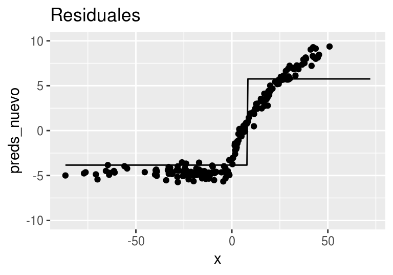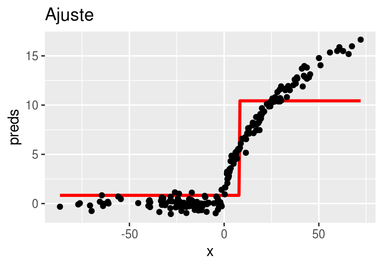

Ajustamos un árbol de regresión a los residuales:


```r
arboles_fsam <- agregar_arbol(arboles_fsam, dat)
```

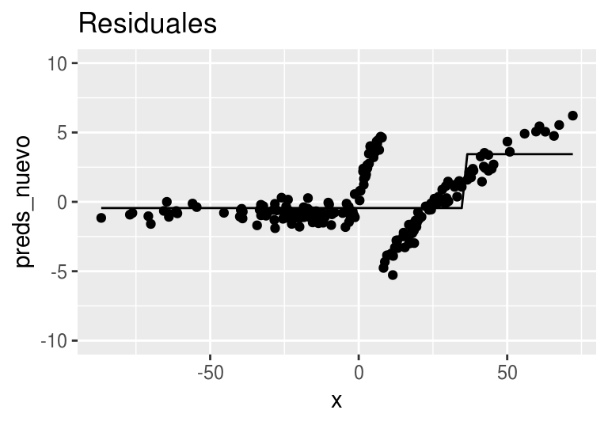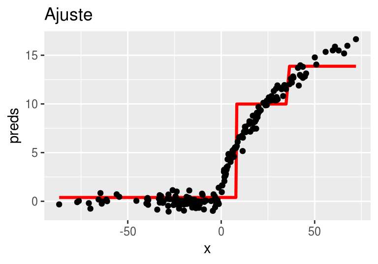


```r
arboles_fsam <- agregar_arbol(arboles_fsam, dat)
```

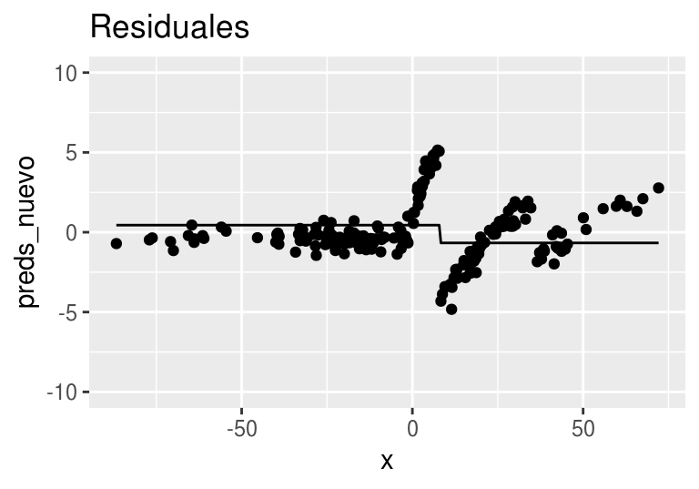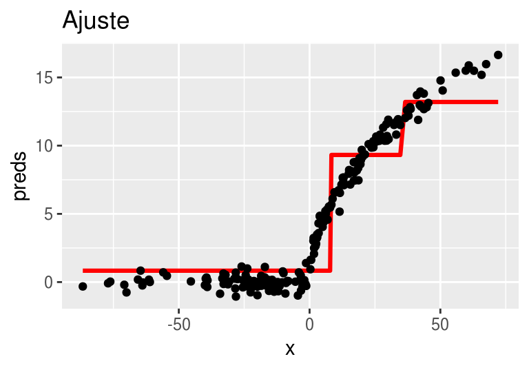


```r
arboles_fsam <- agregar_arbol(arboles_fsam, dat)
```

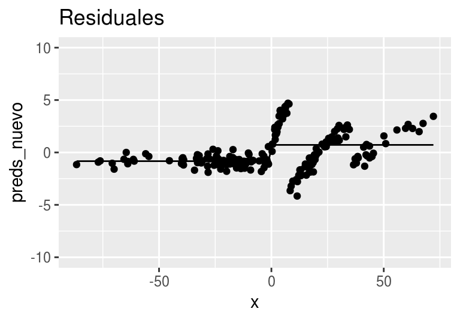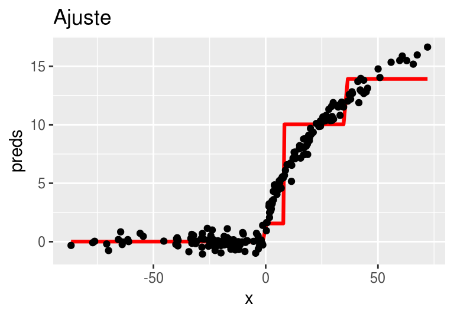


```r
arboles_fsam <- agregar_arbol(arboles_fsam, dat)
```

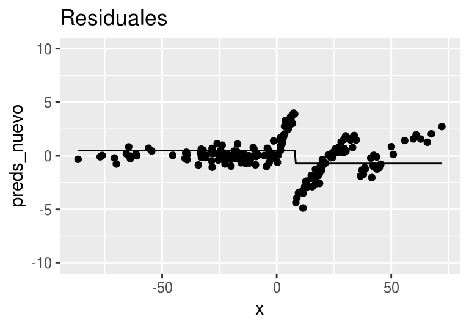


```r
arboles_fsam <- agregar_arbol(arboles_fsam, dat)
```

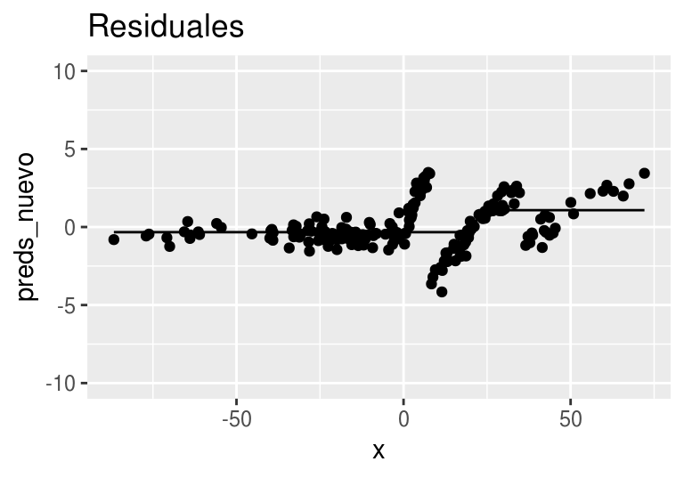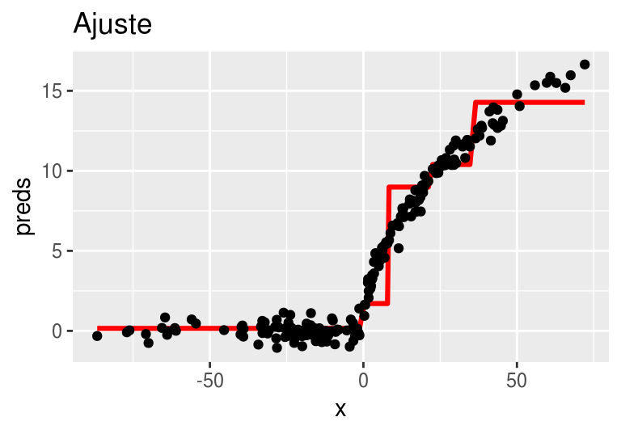

Después de 20 iteraciones obtenemos:


```r
for(j in 1:19){
arboles_fsam <- agregar_arbol(arboles_fsam, dat, plot = FALSE)
}
arboles_fsam <- agregar_arbol(arboles_fsam, dat)
```

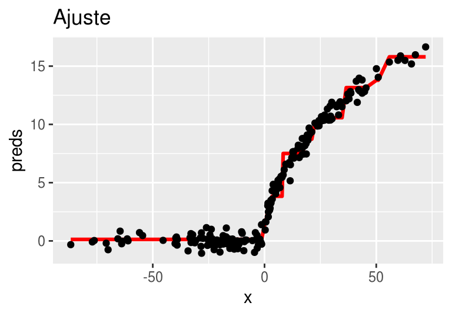


## FSAM para clasificación binaria.

Para problemas de clasificación, no tiene mucho sentido trabajar con un modelo
aditivo sobre las probabilidades:

$$p(x) = \sum_{k=1}^m T_k(x),$$

Así que hacemos lo mismo que en regresión logística. Ponemos

$$f(x) = \sum_{k=1}^m T_k(x),$$

y entonces las probabilidades son
$$p(x) = h(f(x)),$$

donde $h(z)=1/(1+e^{-z})$ es la función logística. La optimización de la etapa $m$ según fsam es

\begin{equation}
T = argmin_{T} \sum_{i=1}^N L(y^{(i)}, f_{m-1}(x^{(i)}) + T(x^{(i)}))
(\#eq:fsam-paso)
\end{equation}

y queremos usar la devianza como función de pérdida. Por razones
de comparación (con nuestro libro de texto y con el algoritmo Adaboost
que mencionaremos más adelante), escogemos usar 
$$y \in \{1,-1\}$$

en lugar de nuestro tradicional $y \in \{1,0\}$. En ese caso, la devianza
binomial se ve como

$$L(y, z) = -\left [ (y+1)\log h(z) - (y-1)\log(1-h(z))\right ],$$
que a su vez se puede escribir como (demostrar):

$$L(y,z) = 2\log(1+e^{-yz})$$
Ahora consideremos cómo se ve nuestro problema de optimización:

$$T = argmin_{T} 2\sum_{i=1}^N \log (1+ e^{-y^{(i)}(f_{m-1}(x^{(i)}) + T(x^{(i)})})$$

Nótese que sólo optimizamos con respecto a $T$, así que
podemos escribir

$$T = argmin_{T} 2\sum_{i=1}^N \log (1+ d_{m,i}e^{- y^{(i)}T(x^{(i)})})$$

Y vemos que el problema es más difícil que en regresión. No podemos usar
un ajuste de árbol usual de regresión o clasificación, *como hicimos en
regresión*. No está claro, por ejemplo, cuál debería ser el residual
que tenemos que ajustar (aunque parece un problema donde los casos
de entrenamiento están ponderados por $d_{m,i}$). Una solución para resolver aproximadamente este problema de minimización, es **gradient boosting**.

## Gradient boosting

La idea de gradient boosting es replicar la idea del residual en regresión, y usar
árboles de regresión para resolver \@ref(eq:fsam-paso).

Gradient boosting es una técnica general para funciones de pérdida
generales.Regresamos entonces a nuestro problema original

$$(\beta_m, b_m) = argmin_{T} \sum_{i=1}^N L(y^{(i)}, f_{m-1}(x^{(i)}) + T(x^{(i)}))$$

La pregunta es: ¿hacia dónde tenemos qué mover la predicción de
$f_{m-1}(x^{(i)})$ sumando
el término $T(x^{(i)})$? Consideremos un solo término de esta suma,
y denotemos $z_i = T(x^{(i)})$. Queremos agregar una cantidad $z_i$
tal que el valor de la pérdida
$$L(y, f_{m-1}(x^{(i)})+z_i)$$
se reduzca. Entonces sabemos que podemos mover la z en la dirección opuesta al gradiente

$$z_i = -\gamma \frac{\partial L}{\partial z}(y^{(i)}, f_{m-1}(x^{(i)}))$$

Sin embargo, necesitamos que las $z_i$ estén generadas por una función $T(x)$ que se pueda evaluar en toda $x$. Quisiéramos que
$$T(x^{(i)})\approx -\gamma \frac{\partial L}{\partial z}(y^{(i)}, f_{m-1}(x^{(i)}))$$
Para tener esta aproximación, podemos poner
$$g_{i,m} = -\frac{\partial L}{\partial z}(y^{(i)}, f_{m-1}(x^{(i)}))$$
e intentar resolver
\begin{equation}
\min_T \sum_{i=1}^n (g_{i,m} - T(x^{(i)}))^2,
(\#eq:min-cuad-boost)
\end{equation}

es decir, intentamos replicar los gradientes lo más que sea posible. **Este problema lo podemos resolver con un árbol usual de regresión**. Finalmente,
podríamos escoger $\nu$ (tamaño de paso) suficientemente chica y ponemos
$$f_m(x) = f_{m-1}(x)+\nu T(x).$$

Podemos hacer un refinamiento adicional que consiste en encontrar los cortes del árbol $T$ según \@ref(eq:min-cuad-boost), pero optimizando por separado los valores que T(x) toma en cada una de las regiones encontradas.

## Algoritmo de gradient boosting

\BeginKnitrBlock{comentario}<div class="comentario">**Gradient boosting** (versión simple)
  
1. Inicializar con $f_0(x) =\gamma$

2. Para $m=0,1,\ldots, M$, 

  - Para $i=1,\ldots, n$, calculamos el residual
  $$r_{i,m}=-\frac{\partial L}{\partial z}(y^{(i)}, f_{m-1}(x^{(i)}))$$
  
  - Ajustamos un árbol de regresión  a la respuesta $r_{1,m},r_{2,m},\ldots, r_{n,m}$. Supongamos que tiene regiones $R_{j,m}$.

  - Resolvemos (optimizamos directamente el valor que toma el árbol en cada región - este es un problema univariado, más fácil de resolver)
  $$\gamma_{j,m} = argmin_\gamma \sum_{x^{(i)}\in R_{j,m}} L(y^{(i)},f_{m-1}(x^{i})+\gamma )$$
    para cada región $R_{j,m}$ del árbol del inciso anterior.
  - Actualizamos $$f_m (x) = f_{m-1}(x) + \sum_j \gamma_{j,m} I(x\in R_{j,m})$$
  3. El predictor final es $f_M(x)$.</div>\EndKnitrBlock{comentario}


## Funciones de pérdida

Para aplicar gradient boosting, tenemos primero que poder calcular
el gradiente de la función de pérdida. Algunos ejemplos populares son:

- Pérdida cuadrática: $L(y,f(x))=(y-f(x))^2$, 
$\frac{\partial L}{\partial z} = -2(y-f(x))$.
- Pérdida absoluta (más robusta a atípicos que la cuadrática) $L(y,f(x))=|y-f(x)|$,
$\frac{\partial L}{\partial z} = signo(y-f(x))$.
- Devianza binomial $L(y, f(x))$ = -\log(1+e^{-yf(x)}), $y\in\{-1,1\}$,
$\frac{\partial L}{\partial z} = I(y=1) - h(f(x))$.
- Adaboost, pérdida exponencial (para clasificación) $L(y,z) = e^{-yf(x)}$,
$y\in\{-1,1\}$,
$\frac{\partial L}{\partial z} = -ye^{-yf(x)}$.

### Discusión: adaboost (opcional)

Adaboost es uno de los algoritmos originales para boosting, y no es necesario
usar gradient boosting para aplicarlo. La razón es que  los árboles de clasificación
$T(x)$ toman valores $T(x)\in \{-1,1\}$, y el paso de optimización
\@ref(eq:fsam-paso) de cada árbol queda

$$T = argmin_{T} \sum_{i=1}^N e^{-y^{(i)}f_{m-1}(x^{(i)})} e^{-y^{(i)}T(x^{(i)})}
$$
$$T = argmin_{T} \sum_{i=1}^N d_{m,i} e^{-y^{(i)}T(x^{(i)})}
$$
De modo que la función objetivo toma dos valores: Si $T(x^{i})$ clasifica
correctamente, entonces $e^{-y^{(i)}T(x^{(i)})}=e^{-1}$, y si
clasifica incorrectamente $e^{-y^{(i)}T(x^{(i)})}=e^{1}$. Podemos entonces
encontrar el árbol $T$ construyendo un árbol usual pero con datos ponderados
por $d_{m,i}$, donde buscamos maximizar la tasa de clasificación correcta (puedes
ver más en nuestro libro de texto, o en [@ESL].

¿Cuáles son las consecuencias de usar la pérdida exponencial? Una es que perdemos
la conexión con los modelos logísticos e interpretación de probabilidad que tenemos
cuando usamos la devianza. Sin embargo, son similares: compara cómo se ve
la devianza (como la formulamos arriba, con $y\in\{-1,1\}$) con la pérdida exponencial.

### Ejemplo {-}

Podemos usar el paquete de R *gbm* para hacer gradient boosting. Para el 
caso de precios de casas de la sección anterior (un problema de regresión).
Para ver un ejemplo distinto, utilizaremos la pérdida absoluta en lugar
de pérdida cuadrática:

Fijaremos el número de árboles en 200, de profundidad 3, usando
75\% de la muestra para entrenar y el restante para validación:


```r
library(gbm)
entrena <- read_rds('datos/ameshousing-entrena-procesado.rds')
set.seed(23411)

ajustar_boost <- function(entrena, ...){
  mod_boosting <- gbm(log(vSalePrice) ~.,  data = entrena,
                distribution = 'laplace',
                n.trees = 200, 
                interaction.depth = 3,
                shrinkage = 1, # tasa de aprendizaje
                bag.fraction = 1,
                train.fraction = 0.75)
  mod_boosting
}

house_boosting <- ajustar_boost(entrena)
dat_entrenamiento <- data_frame(entrena = house_boosting$train.error,
                                valida = house_boosting$valid.error,
                                n_arbol = 1:length(house_boosting$train.error)) %>%
                      gather(tipo, valor, -n_arbol)
print(house_boosting)
```

```
## gbm(formula = log(vSalePrice) ~ ., distribution = "laplace", 
##     data = entrena, n.trees = 200, interaction.depth = 3, shrinkage = 1, 
##     bag.fraction = 1, train.fraction = 0.75)
## A gradient boosted model with laplace loss function.
## 200 iterations were performed.
```

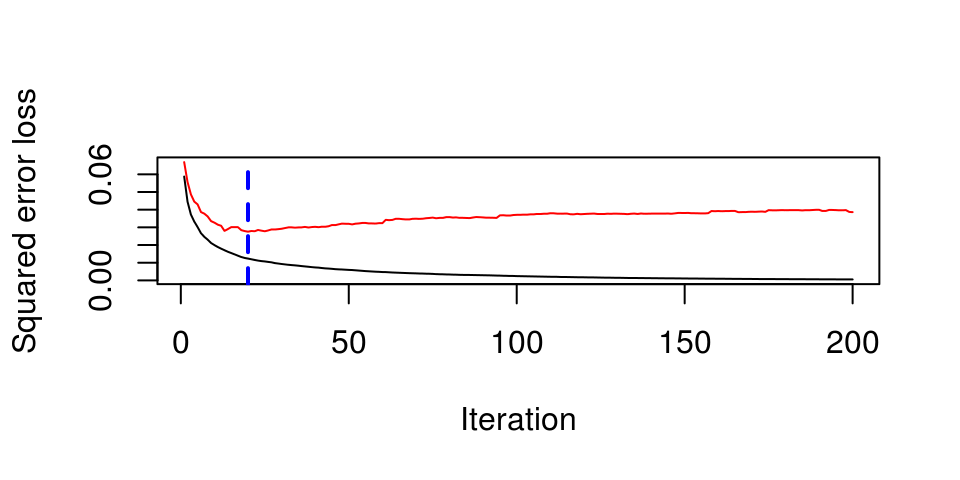

```
## The best test-set iteration was 161.
## There were 79 predictors of which 63 had non-zero influence.
```

```r
ggplot(dat_entrenamiento, aes(x=n_arbol, y=valor, colour=tipo, group=tipo)) +
  geom_line()
```

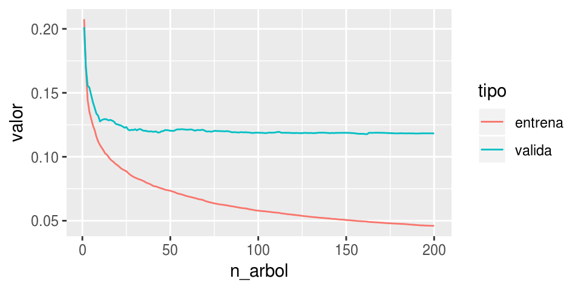

Que se puede graficar también así:

```r
gbm.perf(house_boosting)
```

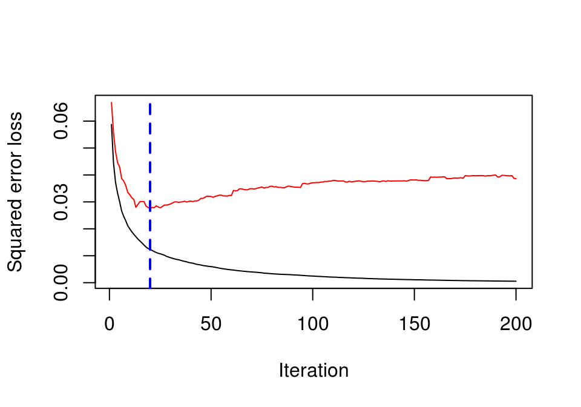

```
## [1] 161
```
Como vemos, tenemos que afinar los parámetros del algoritmo. 


## Modificaciones de Gradient Boosting

Hay algunas adiciones al algoritmo de gradient boosting que podemos
usar para mejorar el desempeño. Los dos métodos que comunmente se
usan son encogimiento (*shrinkage*), que es una especie de tasa de 
aprendizaje, y submuestreo, donde construimos cada árbol adicional 
usando una submuestra de la muestra de entrenamiento.

Ambas podemos verlas como técnicas de regularización, que limitan
sobreajuste producido por el algoritmo agresivo de boosting.


### Tasa de aprendizaje (shrinkage)
Funciona bien modificar el algoritmo usando una tasa de aprendizae
$0<\nu<1$:
$$f_m(x) = f_{m-1}(x) + \nu \sum_j \gamma_{j,m} I(x\in R_{j,m})$$

Este parámetro sirve como una manera de evitar sobreajuste rápido cuando
construimos los predictores. Si este número es muy alto, podemos sobreajustar
rápidamente con pocos árboles, y terminar con predictor de varianza alta. Si este
número es muy bajo, puede ser que necesitemos demasiadas iteraciones para llegar
a buen desempeño.

Igualmente se prueba con varios valores de $0<\nu<1$ (típicamente $\nu<0.1$)
para mejorar el desempeño en validación. **Nota**: cuando hacemos $\nu$ más chica, es necesario hacer $M$ más grande (correr más árboles) para obtener desempeño 
óptimo.

Veamos que efecto tiene en nuestro ejemplo:


```r
modelos_dat <- data_frame(n_modelo = 1:4, shrinkage = c(0.02, 0.05, 0.25, 0.5))
modelos_dat <- modelos_dat %>% 
  mutate(modelo = map(shrinkage, boost)) %>%
  mutate(eval = map(modelo, eval_modelo))
modelos_dat
```

```
## # A tibble: 4 x 4
##   n_modelo shrinkage modelo    eval                
##      <int>     <dbl> <list>    <list>              
## 1        1      0.02 <S3: gbm> <tibble [1,000 × 3]>
## 2        2      0.05 <S3: gbm> <tibble [1,000 × 3]>
## 3        3      0.25 <S3: gbm> <tibble [1,000 × 3]>
## 4        4      0.5  <S3: gbm> <tibble [1,000 × 3]>
```

```r
graf_eval <- modelos_dat %>% select(shrinkage, eval) %>% unnest
graf_eval
```

```
## # A tibble: 4,000 x 4
##    shrinkage n_arbol tipo    valor
##        <dbl>   <int> <chr>   <dbl>
##  1      0.02       1 entrena 0.309
##  2      0.02       2 entrena 0.305
##  3      0.02       3 entrena 0.301
##  4      0.02       4 entrena 0.297
##  5      0.02       5 entrena 0.294
##  6      0.02       6 entrena 0.290
##  7      0.02       7 entrena 0.287
##  8      0.02       8 entrena 0.283
##  9      0.02       9 entrena 0.280
## 10      0.02      10 entrena 0.277
## # ... with 3,990 more rows
```

```r
ggplot(filter(graf_eval), 
       aes(x = n_arbol, y= valor, 
           colour=factor(shrinkage), group = shrinkage)) + 
    geom_line() +
  facet_wrap(~tipo)
```

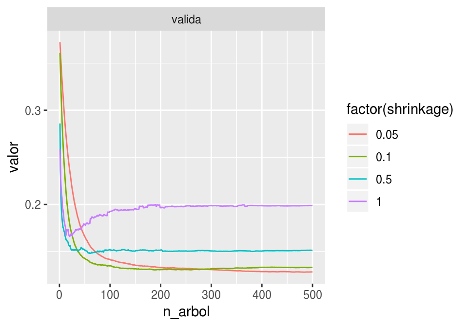

Obsérvese que podemos obtener un mejor resultado de validación afinando
la tasa de aprendizaje. Cuando es muy grande, el modelo rápidamente sobreajusta
cuando agregamos árboles. Si la tasa es demasiado chica, podos tardar
mucho en llegar a un predictor de buen desempeño.

### Submuestreo (bag.fraction)
Funciona bien construir cada uno de los árboles con submuestras de la muestra
de entrenamiento, como una manera adicional de reducir varianza al construir
nuestro predictor (esta idea es parecida a la de los bosques aleatorios, 
aquí igualmente perturbamos la muestra de entrenamiento en cada paso para evitar
sobreajuste). Adicionalmente, este proceso acelera considerablemente las
iteraciones de boosting, y en algunos casos sin penalización en desempeño.

En boosting generalmente se toman submuestras (una
fracción de alrededor de 0.5 de la muestra de entrenamiento, pero puede
ser más chica para conjuntos grandes de entrenamiento) sin reemplazo.

Este parámetro también puede ser afinado con muestra
de validación o validación cruzada. 


```r
boost <- ajustar_boost(entrena)
modelos_dat <- data_frame(n_modelo = 1:3, 
                          bag.fraction = c(0.25, 0.5, 1),
                          shrinkage = 0.25)
modelos_dat <- modelos_dat %>% 
  mutate(modelo = pmap(., boost)) %>%
  mutate(eval = map(modelo, eval_modelo))
modelos_dat
```

```
## # A tibble: 3 x 5
##   n_modelo bag.fraction shrinkage modelo    eval                
##      <int>        <dbl>     <dbl> <list>    <list>              
## 1        1         0.25      0.25 <S3: gbm> <tibble [1,000 × 3]>
## 2        2         0.5       0.25 <S3: gbm> <tibble [1,000 × 3]>
## 3        3         1         0.25 <S3: gbm> <tibble [1,000 × 3]>
```

```r
graf_eval <- modelos_dat %>% select(bag.fraction, eval) %>% unnest
graf_eval
```

```
## # A tibble: 3,000 x 4
##    bag.fraction n_arbol tipo    valor
##           <dbl>   <int> <chr>   <dbl>
##  1         0.25       1 entrena 0.269
##  2         0.25       2 entrena 0.232
##  3         0.25       3 entrena 0.211
##  4         0.25       4 entrena 0.194
##  5         0.25       5 entrena 0.179
##  6         0.25       6 entrena 0.170
##  7         0.25       7 entrena 0.162
##  8         0.25       8 entrena 0.152
##  9         0.25       9 entrena 0.147
## 10         0.25      10 entrena 0.142
## # ... with 2,990 more rows
```

```r
ggplot((graf_eval), aes(x = n_arbol, y= valor, colour=factor(bag.fraction), group =
                        bag.fraction)) + geom_line() +
  facet_wrap(~tipo, ncol = 1)
```

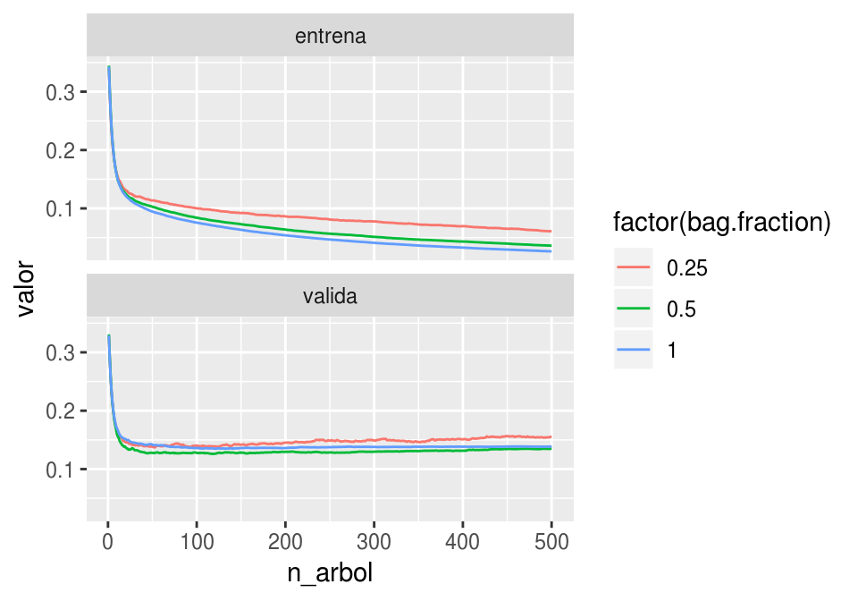

En este ejemplo, podemos reducir el tiempo de ajuste usando una 
fracción de submuestro de 0.5, con quizá algunas mejoras en desempeño.


Ahora veamos los dos parámetros actuando en conjunto:


```r
modelos_dat <- list(bag.fraction = c(0.1, 0.25, 0.5, 1),
                          shrinkage = c(0.01, 0.1, 0.25, 0.5)) %>% expand.grid
modelos_dat <- modelos_dat %>% 
  mutate(modelo = pmap(., boost)) %>%
  mutate(eval = map(modelo, eval_modelo))
graf_eval <- modelos_dat %>% select(shrinkage, bag.fraction, eval) %>% unnest
head(graf_eval)
```

```
##   shrinkage bag.fraction n_arbol    tipo     valor
## 1      0.01          0.1       1 entrena 0.3108616
## 2      0.01          0.1       2 entrena 0.3087372
## 3      0.01          0.1       3 entrena 0.3065518
## 4      0.01          0.1       4 entrena 0.3047564
## 5      0.01          0.1       5 entrena 0.3027629
## 6      0.01          0.1       6 entrena 0.3010770
```

```r
ggplot(filter(graf_eval, tipo =='valida'), aes(x = n_arbol, y= valor, colour=factor(bag.fraction), group =
                        bag.fraction)) + geom_line() +
  facet_wrap(~shrinkage)
```

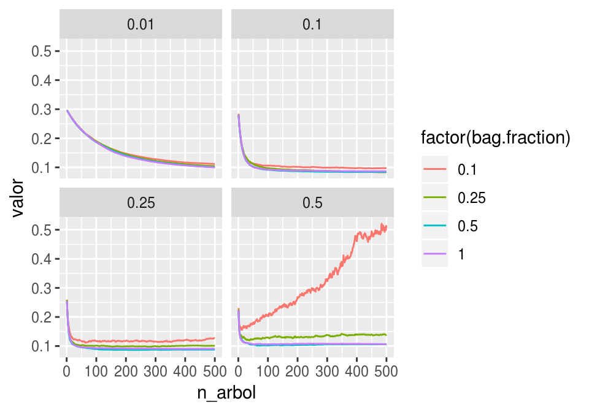

Bag fraction demasiado chico no funciona bien, especialmente si la tasa
de aprendizaje es alta (¿Por qué?). Filtremos para ver con detalle el resto
de los datos:


```r
ggplot(filter(graf_eval, tipo =='valida', bag.fraction>0.1), aes(x = n_arbol, y= valor, colour=factor(bag.fraction), group =
                        bag.fraction)) + geom_line() +
  facet_wrap(~shrinkage) + scale_y_log10()
```

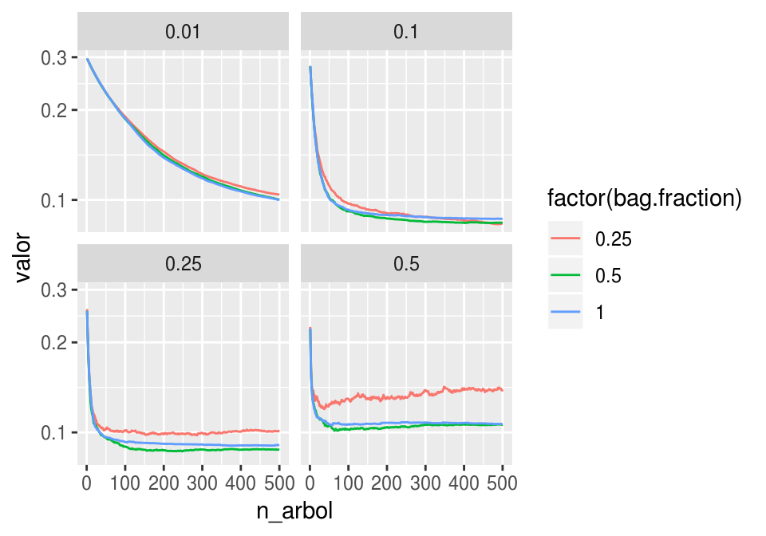


Y parece ser que para este número de iteraciones, una tasa de aprendizaje
de 0.1 junto con un bag fraction de 0.5 funciona bien:


```r
graf_eval %>% filter(tipo=='valida') %>%
  group_by(shrinkage, bag.fraction) %>%
  summarise(valor = min(valor)) %>%
   arrange(valor) %>% head(10)
```

```
## # A tibble: 10 x 3
## # Groups:   shrinkage [4]
##    shrinkage bag.fraction  valor
##        <dbl>        <dbl>  <dbl>
##  1      0.1          0.25 0.0830
##  2      0.1          0.5  0.0837
##  3      0.1          1    0.0864
##  4      0.25         0.5  0.0865
##  5      0.25         1    0.0903
##  6      0.1          0.1  0.0964
##  7      0.25         0.25 0.0979
##  8      0.01         1    0.100 
##  9      0.01         0.5  0.100 
## 10      0.5          0.5  0.101
```


### Número de árboles M

Se monitorea el error sobre una muestra de validación cuando agregamos
cada árboles. Escogemos el número de árboles de manera que minimize el
error de validación. Demasiados árboles pueden producir sobreajuste. Ver el ejemplo
de arriba.


### Tamaño de árboles

Los árboles se construyen de tamaño fijo $J$, donde $J$ es el número
de cortes. Usualmente $J=1,2,\ldots, 10$, y es un parámetro que hay que
elegir. $J$ más grande permite interacciones de orden más alto entre 
las variables de entrada. Se intenta con varias $J$ y $M$ para minimizar
el error de validación.

### Controlar número de casos para cortes

Igual que en bosques aleatorios, podemos establecer mínimos de muestra en nodos
terminales, o mínimo de casos necesarios para hacer un corte.

### Ejemplo {-}


```r
modelos_dat <- list(bag.fraction = c( 0.25, 0.5, 1),
                          shrinkage = c(0.01, 0.1, 0.25, 0.5),
                    depth = c(1,5,10,12)) %>% expand.grid
modelos_dat <- modelos_dat %>% 
  mutate(modelo = pmap(., boost)) %>%
  mutate(eval = map(modelo, eval_modelo))
graf_eval <- modelos_dat %>% select(shrinkage, bag.fraction, depth, eval) %>% unnest
ggplot(filter(graf_eval, tipo =='valida'), aes(x = n_arbol, y= valor,
    colour=factor(bag.fraction), group = bag.fraction)) + 
  geom_line() +
  facet_grid(depth~shrinkage) + scale_y_log10()
```

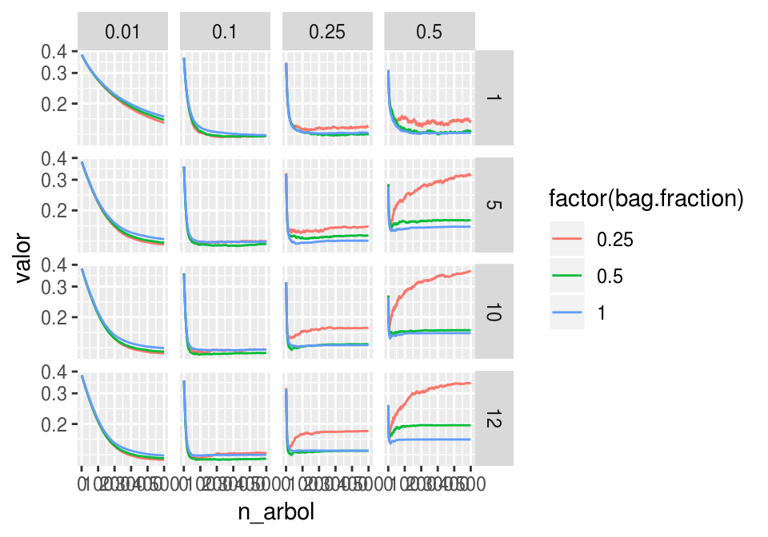


Podemos ver con más detalle donde ocurre el mejor desempeño:


```r
ggplot(
    filter(graf_eval, tipo =='valida', shrinkage == 0.1, n_arbol > 100), aes(x = n_arbol, y= valor, colour=factor(bag.fraction), group =
                        bag.fraction)) + geom_line() +
  facet_grid(depth~shrinkage) 
```

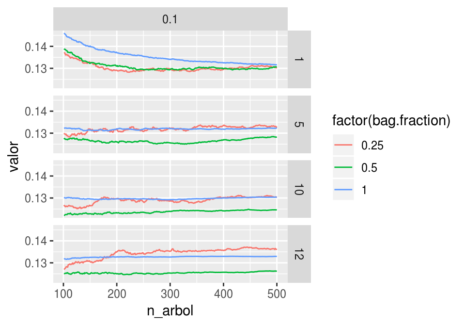


```r
head(arrange(filter(graf_eval,tipo=='valida'), valor))
```

```
##   shrinkage bag.fraction depth n_arbol   tipo      valor
## 1       0.1          0.5    10     348 valida 0.08126603
## 2       0.1          0.5    10     342 valida 0.08128108
## 3       0.1          0.5    10     346 valida 0.08128677
## 4       0.1          0.5    10     343 valida 0.08129096
## 5       0.1          0.5    10     347 valida 0.08129531
## 6       0.1          0.5    10     341 valida 0.08129727
```

### Evaluación con validación cruzada.

Para datos no muy grandes, conviene escoger modelos usando validación cruzada.

Por ejemplo,


```r
set.seed(9983)
rm('modelos_dat')
mod_boosting <- gbm(log(vSalePrice) ~.,  data = entrena,
                distribution = 'laplace',
                n.trees = 200, 
                interaction.depth = 10,
                shrinkage = 0.1, # tasa de aprendizaje
                bag.fraction = 0.5,
                cv.folds = 10)
gbm.perf(mod_boosting)
```


```r
eval_modelo_2 <- function(modelo){
   dat_eval <- data_frame(entrena = modelo$train.error,
                          valida = modelo$cv.error,
                          n_arbol = 1:length(modelo$train.error)) %>%
                      gather(tipo, valor, -n_arbol)
   dat_eval
}
dat <- eval_modelo_2(mod_boosting)
(min(mod_boosting$cv.error))
ggplot(dat, aes(x = n_arbol, y=valor, colour=tipo, group=tipo)) + geom_line()
```

## Gráficas de dependencia parcial

La idea de dependencia parcial que veremos a continuación se puede aplicar a cualquier método de aprendizaje,
y en boosting ayuda a entender el funcionamiento del predictor complejo que resulta
del algoritmo. Aunque podemos evaluar el predictor en distintos valores y observar
cómo se comporta, cuando tenemos varias variables de entrada este proceso no
siempre tiene resultados muy claros o completos. Dependencia parcial es un intento
por entender de manera más sistemática parte del funcionamiento de 
un modelo complejo.


### Dependencia parcial
Supongamos que tenemos un predictor $f(x_1,x_2)$ que depende de dos variables de
entrada. Podemos considerar la función
$${f}_{1}(x_1) = E_{x_2}[f(x_1,x_2)],$$
que es el promedio de $f(x)$ fijando $x_1$ sobre la marginal de $x_2$. Si tenemos
una muestra de entrenamiento, podríamos estimarla promediando sobre la muestra 
de entrenamiento

$$\bar{f}_1(x_1) = \frac{1}{n}\sum_{i=1}^n f(x_1, x_2^{(i)}),$$
que consiste en fijar el valor de $x_1$ y promediar sobre todos los valores
de la muestra de entrenamiento para $x_2$.

### Ejemplo {-}

Construimos un modelo con solamente tres variables para nuestro ejemplo anterior


```r
mod_2 <- gbm(log(vSalePrice) ~ vGrLivArea +vNeighborhood  +
                 vOverallQual + vBsmtFinSF1,  
                data = entrena,
                distribution = 'laplace',
                n.trees = 500, 
                interaction.depth = 4,
                shrinkage = 0.1, 
                bag.fraction = 0.5,
                train.fraction = 0.75)
```

Podemos calcular a mano la gráfica de dependencia parcial para 
el tamaño de la "General Living Area". Seleccionamos las variables:

```r
dat_dp <- entrena %>% select(vGrLivArea, vNeighborhood, vOverallQual, vBsmtFinSF1) 
```
Ahora consideramos el rango de la variable para establecer en dónde
vamos evaluar las función de dependiencia parcial:

```r
cuantiles <- quantile(entrena$vGrLivArea, probs= seq(0, 1, 0.1))
cuantiles
```

```
##     0%    10%    20%    30%    40%    50%    60%    70%    80%    90% 
##  334.0  912.0 1066.6 1208.0 1339.0 1464.0 1578.0 1709.3 1869.0 2158.3 
##   100% 
## 5642.0
```

Por ejemplo, vamos evaluar el efecto parcial cuando vGrLivArea = 912. Hacemos


```r
dat_dp_1 <- dat_dp %>% mutate(vGrLivArea = 912) %>%
            mutate(pred = predict(mod_2, .)) %>%
            summarise(mean_pred = mean(pred))
```

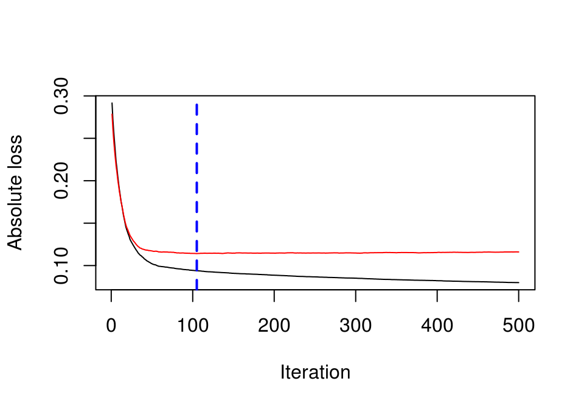

```
## Using 105 trees...
```

```r
dat_dp_1
```

```
##   mean_pred
## 1  11.84386
```

Evaluamos en vGrLivArea = 1208

```r
dat_dp_1 <- dat_dp %>% mutate(vGrLivArea = 1208) %>%
            mutate(pred = predict(mod_2, .)) %>%
            summarise(mean_pred = mean(pred))
```


```
## Using 105 trees...
```

```r
dat_dp_1
```

```
##   mean_pred
## 1  11.96169
```
(un incremento de alrededor del 10\% en el precio de venta).

Hacemos todos los percentiles como sigue:


```r
cuantiles <- quantile(entrena$vGrLivArea, probs= seq(0, 1, 0.01))

prom_parcial <- function(x, variable, df, mod){
  variable <- enquo(variable)
  variable_nom <- quo_name(variable)
  salida <- df %>% mutate(!!variable_nom := x) %>% 
    mutate(pred = predict(mod, ., n.trees = 500)) %>%
    group_by(!!variable) %>%
    summarise(f_1 = mean(pred)) 
  salida
}
dep_parcial <- map_dfr(cuantiles, 
                       ~prom_parcial(.x, vGrLivArea, entrena, mod_2))
ggplot(dep_parcial, aes(x=vGrLivArea, y = f_1)) + 
  geom_line() + geom_line() + geom_rug(sides='b')
```

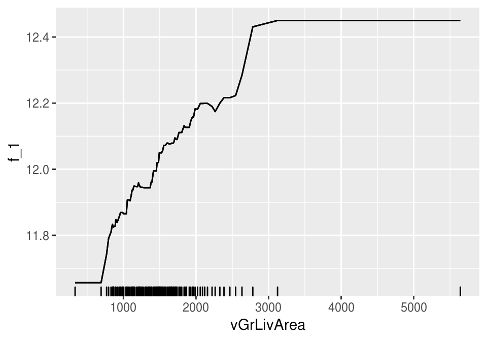
Y transformando a las unidades originales


```r
ggplot(dep_parcial, aes(x=vGrLivArea, y= exp(f_1))) + 
  geom_line() + geom_line() + geom_rug(sides='b')
```

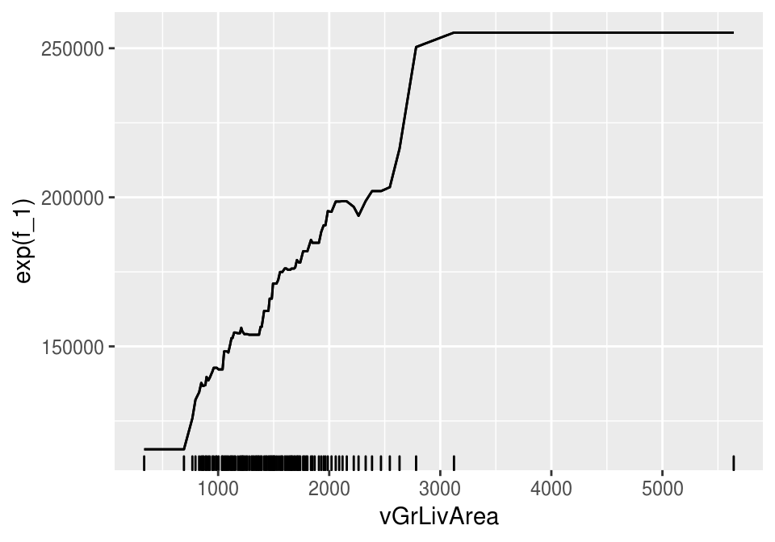
Y vemos que cuando aumenta el area de habitación, aumenta el precio. Podemos hacer esta gráfica más simple haciendo


```r
plot(mod_2, 1) # 1 pues es vGrLivArea la primer variable 
```

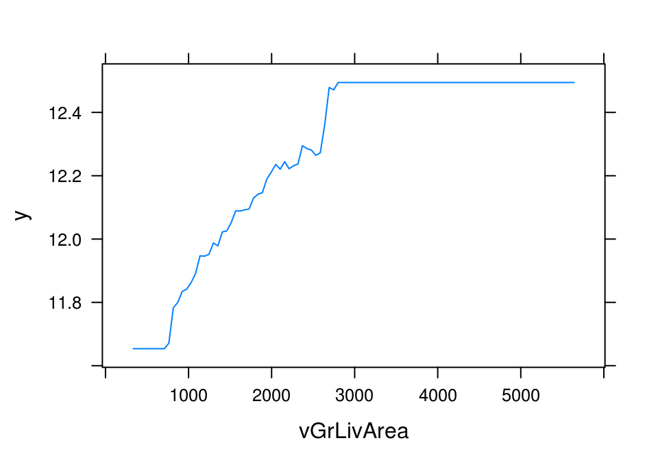


### Discusión {-}

En primer lugar, veamos qué obtenemos de la dependencia parcial
cuando aplicamos al modelo lineal sin interacciones. En el caso de dos variables,

$$f_1(x_1) = E_{x_2}[f(x_1,x_2)] =E_{x_2}[a + bx_1 + cx_2)] = \mu + bx_1,$$
que es equivalente al análisis marginal que hacemos en regresión lineal (
incrementos en la variable $x_1$ con todo lo demás fijo, donde el incremento
marginal de la respuesta es el coeficiente $b$). 

Desde este punto de vista, dependencia parcial da una interpretación similar
a la del análisis usual de coeficientes en regresión lineal, donde pensamos
en "todo lo demás constante".

Igualmente, si el modelo fuera aditivo de la forma 
$f(x_1,x_2) = h_1(x_1) + h_2(x_2)$
obtendríamos
$$f_1(x_1) = E_{x_2}[h_1(x_1) + h_2(x_2)] = \mu + h_1(x_1),$$
y recuperaríamos otra vez la interpetación de "todo lo demás constante".

---

Para una variable categórica las gráficas de dependencia
parcial se ven como sigue. Escribimos las
cantidades logarítmicas en la escala original:


```r
dep_parcial <- plot(mod_2, 2, return.grid = TRUE) %>% arrange(y)
dep_parcial$vNeighborhood <- reorder(dep_parcial$vNeighborhood, dep_parcial$y)
ggplot(dep_parcial, aes(x = vNeighborhood, y = exp(y))) + geom_point() +
    coord_flip()
```

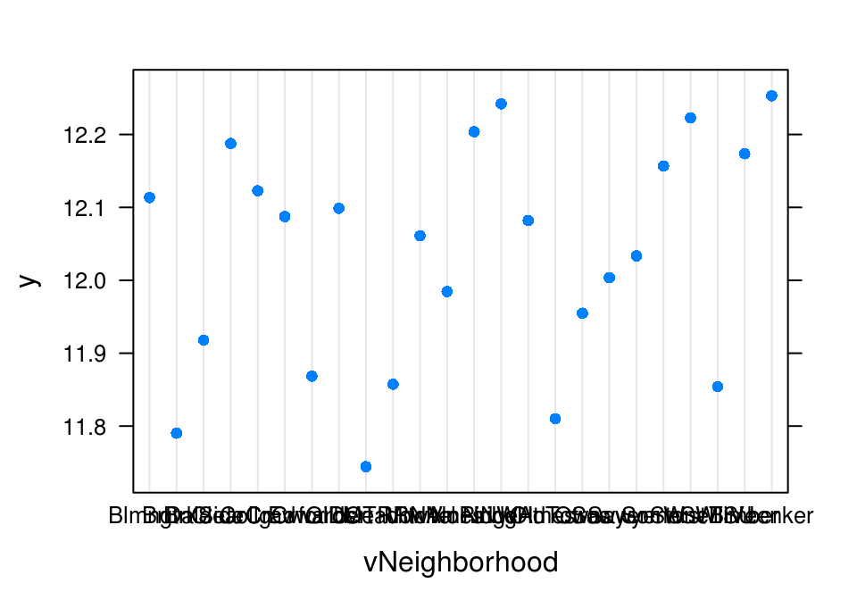

---

En general, si nuestro predictor depende de más variables 
$f(x_1,x_2, \ldots, x_p)$ 
entrada. Podemos considerar las funciones
$${f}_{j}(x_j) = E_{(x_1,x_2, \ldots x_p) - x_j}[f(x_1,x_2, \ldots, x_p)],$$
que es el valor esperado de $f(x)$ fijando $x_j$, y promediando sobre el resto
de las variables. Si tenemos
una muestra de entrenamiento, podríamos estimarla promediando sobre la muestra 
de entrenamiento

$$\bar{f}_j(x_j) = \frac{1}{n}\sum_{i=1}^n f(x_1^{(i)}, x_2^{(i)}, \ldots, x_{j-1}^{(i)},\, x_j,\,  x_{j+1}^{(i)},\ldots, x_p^{(i)}).$$

Podemos hacer también  gráficas de dependencia parcial para más de una variable,
si fijamos un subconjunto de variables y promediamos sobre el resto.


```r
plot(mod_2, c(1,3))
```

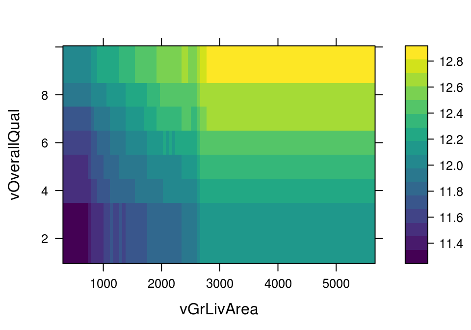

Que también podemos graficar como


```r
grid_dp <- plot(mod_2, c(1,3), level.plot = FALSE, return.grid = TRUE)
ggplot(grid_dp, aes(x = vGrLivArea, y = y, 
        colour = vOverallQual, group = vOverallQual)) + geom_line() +
    xlim(c(0, 3000))
```

```
## Warning: Removed 5000 rows containing missing values (geom_path).
```

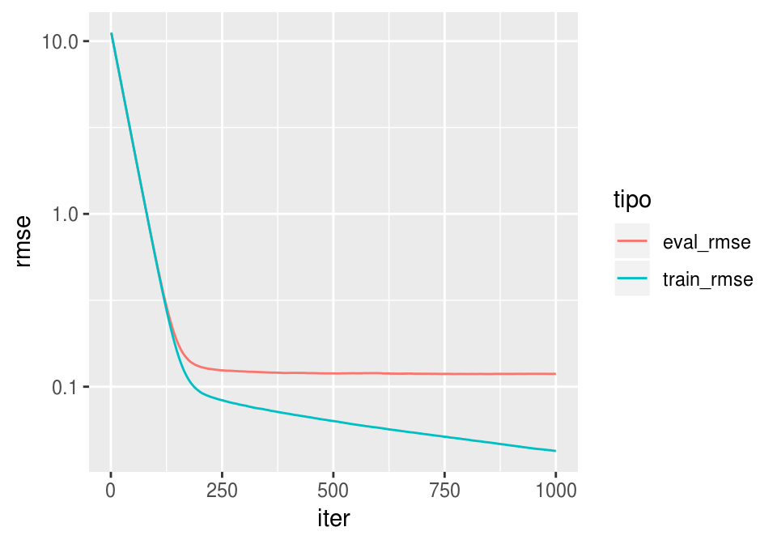

En este caso, no vemos interacciones grandes (GrLivArea y OverallQual) 
en nuestro modelo.

---

#### Más de interpretación {-}

Es importante evitar la interpretación incorrecta de que la función
de dependencia parcial da el valor esperado del predictor condicionado a valores
de la variable cuya dependencia examinamos. Es decir, 
$$f_1(x_1) = E_{x_2}(f(x_1,x_2)) \neq E(f(x_1,x_2)|x_1).$$
La última cantidad es un valor esperado diferente (calculado sobre la
condicional de $x_2$ dada $x_1$), de manera que utiliza información acerca
de la relación que hay entre $x_1$ y $x_2$, y se puede interpretar
como el valor esperado del predictor ingorando $x_2$. 
La función de dependencia parcial
da el efecto de $x_1$ tomando en cuenta los efectos *promedio* de las otras variables.

#### Ejemplos {-}

Considramos $f(x_1,x_2) = h_1(x_1)h_2(x_2) = x_1x_2$, donde  x_1 y x_2 tienen medias $a_1$ y $a_2$.
La función de dependiencia parcial de $x_1$ es (demuéstralo):
$\bar{f}_1(x_1) = a_2 x_1,$
que nos muestra el efecto de $x_1$ promediando sobre $x_2$.
Sin embargo, la condicional de la predicción dada $x_1$ es diferente:
$$f_1(x_1) = E(x_1x_2 | x_1) = x_1 E(x_2 | x_1)$$
y el valor esperado condicional puede ser una función complicada. Por ejemplo,
si hay correlación lineal entre $x_1$ y $x_2$ podríamos tener
$E(x_2 | x_1) = ax_1 + b$, etc. Esta cantidad tiene sus usos (por ejemplo,
hacer predicciones cuando no tenemos $x_2$), pero para entender el
efecto univariado de $x_1$ generalmente es más fácil considerar la 
función de dependiencia parcial.

---

Finalmente, nótese que cuando hay **interacciones** fuertes entre las variables, ningún análisis marginal (dependencia parcial o examen de coeficientes) da un resultado tan fácilmente interpretabl. La única solución es considerar el efecto conjunto de las variables que interactúan. De modo que este tipo de análisis funciona mejor
cuando no hay interacciones grandes entre las variables (es cercano a un modelo
aditivo con efectos no lineales).

### Gráficas de dependencia parcial para otros modelos

Como dijimos en la introducción, las gráficas de dependiencia parcial
pueden utilizarse para cualquier tipo de modelo.

#### Ejemplo: regresión lineal

¿Qué esperamos si aplicamos a un modelo de regresión lineal?


```r
library(pdp)
```

```
## 
## Attaching package: 'pdp'
```

```
## The following object is masked from 'package:purrr':
## 
##     partial
```

```r
mod_lm <- lm(log(vSalePrice) ~ vGrLivArea +vNeighborhood  +
                 vOverallQual + vBsmtFinSF1, entrena)
mod_lm
```

```
## 
## Call:
## lm(formula = log(vSalePrice) ~ vGrLivArea + vNeighborhood + vOverallQual + 
##     vBsmtFinSF1, data = entrena)
## 
## Coefficients:
##          (Intercept)            vGrLivArea   vNeighborhoodBrDale  
##           10.9781318             0.0002519            -0.3876381  
## vNeighborhoodBrkSide  vNeighborhoodClearCr  vNeighborhoodCollgCr  
##           -0.1931159             0.0784516             0.0131924  
## vNeighborhoodCrawfor  vNeighborhoodEdwards  vNeighborhoodGilbert  
##            0.0180111            -0.2231209             0.0006351  
##  vNeighborhoodIDOTRR  vNeighborhoodMeadowV  vNeighborhoodMitchel  
##           -0.3716332            -0.3176807            -0.0713348  
##   vNeighborhoodNAmes  vNeighborhoodNoRidge  vNeighborhoodNridgHt  
##           -0.0981734             0.0806283             0.1502544  
##  vNeighborhoodNWAmes  vNeighborhoodOldTown    vNeighborhoodOtros  
##           -0.0528433            -0.2732835            -0.1615437  
##  vNeighborhoodSawyer  vNeighborhoodSawyerW  vNeighborhoodSomerst  
##           -0.0956738            -0.0621679             0.0521564  
## vNeighborhoodStoneBr    vNeighborhoodSWISU   vNeighborhoodTimber  
##            0.1231436            -0.2302935             0.0593881  
## vNeighborhoodVeenker          vOverallQual           vBsmtFinSF1  
##            0.1294244             0.1129118             0.0001089
```

```r
mod_lm %>%
    partial(pred.var = "vGrLivArea") %>%
    autoplot(rug = TRUE, train = entrena)
```

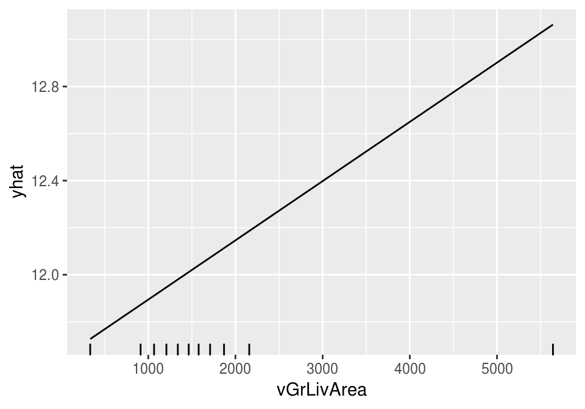

#### Ejemplo: bosque aleatorio


```r
library(randomForest)
mod_bosque <- randomForest(log(vSalePrice) ~ vGrLivArea +vNeighborhood  +
                 vOverallQual + vBsmtFinSF1, data = entrena)
mod_bosque
```

```
## 
## Call:
##  randomForest(formula = log(vSalePrice) ~ vGrLivArea + vNeighborhood +      vOverallQual + vBsmtFinSF1, data = entrena) 
##                Type of random forest: regression
##                      Number of trees: 500
## No. of variables tried at each split: 1
## 
##           Mean of squared residuals: 0.02367802
##                     % Var explained: 85.15
```

```r
mod_bosque %>%
    partial(pred.var = "vGrLivArea") %>%
    autoplot(rug = TRUE, train = entrena)
```


```r
mod_bosque %>%
    partial(pred.var = c("vGrLivArea", "vOverallQual")) %>%
    autoplot(rug = TRUE, train = entrena)
```

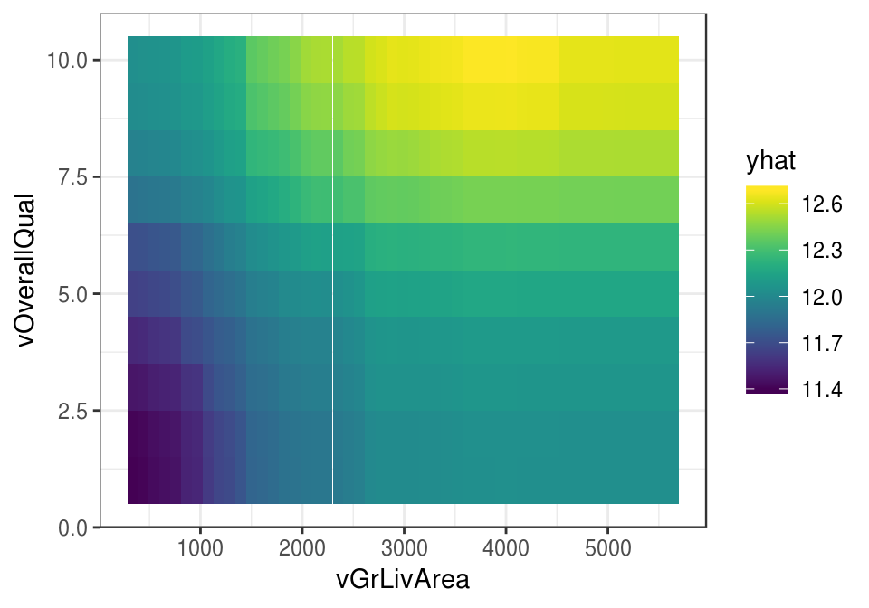


Puedes ver más técnicas en [Interpretable Machine Learning](https://christophm.github.io/interpretable-ml-book/), por ejemplo.

## xgboost y gbm

Los paquetes *xgboost* y *gbm* parecen ser los más populares para hacer
gradient boosting.  *xgboost*,
adicionalmente, parece ser más rápido y más flexible que *gbm* (paralelización, uso de GPU integrado). Existe una lista considerable de competencias de predicción donde el algoritmo/implementación
ganadora es *xgboost*. 


```r
library(xgboost)
```

```
## 
## Attaching package: 'xgboost'
```

```
## The following object is masked from 'package:dplyr':
## 
##     slice
```

```r
x <- entrena %>% select(-vSalePrice) %>% model.matrix(~., .)
x_entrena <- x[1:1100, ]
x_valida <- x[1101:1460, ]
set.seed(1293)
d_entrena <- xgb.DMatrix(x_entrena, label = log(entrena$vSalePrice[1:1100])) 
d_valida <- xgb.DMatrix(x_valida, label = log(entrena$vSalePrice[1101:1460])) 
watchlist <- list(eval = d_valida, train = d_entrena)
params <- list(booster = "gbtree",
               max_depth = 3, 
               eta = 0.03, 
               nthread = 1, 
               subsample = 0.75, 
               lambda = 0.001,
               objective = "reg:linear", 
               eval_metric = "mae") # error absoluto
bst <- xgb.train(params, d_entrena, nrounds = 1000, watchlist = watchlist, verbose=1)
```

```
## [1]	eval-mae:11.176984	train-mae:11.178999 
## [2]	eval-mae:10.841721	train-mae:10.843556 
## [3]	eval-mae:10.516091	train-mae:10.518085 
## [4]	eval-mae:10.200583	train-mae:10.202491 
## [5]	eval-mae:9.894920	train-mae:9.896530 
## [6]	eval-mae:9.598317	train-mae:9.599773 
## [7]	eval-mae:9.310502	train-mae:9.311866 
## [8]	eval-mae:9.031566	train-mae:9.032389 
## [9]	eval-mae:8.760724	train-mae:8.761462 
## [10]	eval-mae:8.498172	train-mae:8.498637 
## [11]	eval-mae:8.243278	train-mae:8.243702 
## [12]	eval-mae:7.996028	train-mae:7.996329 
## [13]	eval-mae:7.756287	train-mae:7.756411 
## [14]	eval-mae:7.523738	train-mae:7.523695 
## [15]	eval-mae:7.298147	train-mae:7.298057 
## [16]	eval-mae:7.079457	train-mae:7.079143 
## [17]	eval-mae:6.867540	train-mae:6.866744 
## [18]	eval-mae:6.661871	train-mae:6.660701 
## [19]	eval-mae:6.462197	train-mae:6.460776 
## [20]	eval-mae:6.268476	train-mae:6.266927 
## [21]	eval-mae:6.080146	train-mae:6.078687 
## [22]	eval-mae:5.897626	train-mae:5.896358 
## [23]	eval-mae:5.720685	train-mae:5.719357 
## [24]	eval-mae:5.549398	train-mae:5.547802 
## [25]	eval-mae:5.382868	train-mae:5.381410 
## [26]	eval-mae:5.221207	train-mae:5.219763 
## [27]	eval-mae:5.064470	train-mae:5.063203 
## [28]	eval-mae:4.912503	train-mae:4.911200 
## [29]	eval-mae:4.764926	train-mae:4.763807 
## [30]	eval-mae:4.622063	train-mae:4.620884 
## [31]	eval-mae:4.483413	train-mae:4.482223 
## [32]	eval-mae:4.348776	train-mae:4.347674 
## [33]	eval-mae:4.218169	train-mae:4.217224 
## [34]	eval-mae:4.091733	train-mae:4.090778 
## [35]	eval-mae:3.968975	train-mae:3.968010 
## [36]	eval-mae:3.849841	train-mae:3.848888 
## [37]	eval-mae:3.734298	train-mae:3.733345 
## [38]	eval-mae:3.622312	train-mae:3.621352 
## [39]	eval-mae:3.513997	train-mae:3.512828 
## [40]	eval-mae:3.408348	train-mae:3.407215 
## [41]	eval-mae:3.306162	train-mae:3.304984 
## [42]	eval-mae:3.206973	train-mae:3.205757 
## [43]	eval-mae:3.110841	train-mae:3.109580 
## [44]	eval-mae:3.017576	train-mae:3.016211 
## [45]	eval-mae:2.926954	train-mae:2.925621 
## [46]	eval-mae:2.839241	train-mae:2.837812 
## [47]	eval-mae:2.754123	train-mae:2.752701 
## [48]	eval-mae:2.671518	train-mae:2.670100 
## [49]	eval-mae:2.591545	train-mae:2.590034 
## [50]	eval-mae:2.513927	train-mae:2.512405 
## [51]	eval-mae:2.438531	train-mae:2.437090 
## [52]	eval-mae:2.365263	train-mae:2.363928 
## [53]	eval-mae:2.294239	train-mae:2.292855 
## [54]	eval-mae:2.225363	train-mae:2.224102 
## [55]	eval-mae:2.158767	train-mae:2.157321 
## [56]	eval-mae:2.093980	train-mae:2.092589 
## [57]	eval-mae:2.031284	train-mae:2.029821 
## [58]	eval-mae:1.970396	train-mae:1.969090 
## [59]	eval-mae:1.911263	train-mae:1.910023 
## [60]	eval-mae:1.854034	train-mae:1.852790 
## [61]	eval-mae:1.798455	train-mae:1.797090 
## [62]	eval-mae:1.744618	train-mae:1.743325 
## [63]	eval-mae:1.692358	train-mae:1.691019 
## [64]	eval-mae:1.641327	train-mae:1.640058 
## [65]	eval-mae:1.592239	train-mae:1.590907 
## [66]	eval-mae:1.544698	train-mae:1.543235 
## [67]	eval-mae:1.498477	train-mae:1.496958 
## [68]	eval-mae:1.453635	train-mae:1.452130 
## [69]	eval-mae:1.409772	train-mae:1.408428 
## [70]	eval-mae:1.367715	train-mae:1.366239 
## [71]	eval-mae:1.326800	train-mae:1.325253 
## [72]	eval-mae:1.287248	train-mae:1.285523 
## [73]	eval-mae:1.248763	train-mae:1.246932 
## [74]	eval-mae:1.211261	train-mae:1.209524 
## [75]	eval-mae:1.174987	train-mae:1.173262 
## [76]	eval-mae:1.139906	train-mae:1.138175 
## [77]	eval-mae:1.105752	train-mae:1.104045 
## [78]	eval-mae:1.072770	train-mae:1.070972 
## [79]	eval-mae:1.040598	train-mae:1.038826 
## [80]	eval-mae:1.009650	train-mae:1.007721 
## [81]	eval-mae:0.979265	train-mae:0.977407 
## [82]	eval-mae:0.950001	train-mae:0.948159 
## [83]	eval-mae:0.921491	train-mae:0.919640 
## [84]	eval-mae:0.894094	train-mae:0.892078 
## [85]	eval-mae:0.867323	train-mae:0.865286 
## [86]	eval-mae:0.841607	train-mae:0.839350 
## [87]	eval-mae:0.816515	train-mae:0.814126 
## [88]	eval-mae:0.792066	train-mae:0.789763 
## [89]	eval-mae:0.768292	train-mae:0.766059 
## [90]	eval-mae:0.745335	train-mae:0.743182 
## [91]	eval-mae:0.723135	train-mae:0.720921 
## [92]	eval-mae:0.701431	train-mae:0.699273 
## [93]	eval-mae:0.680305	train-mae:0.678268 
## [94]	eval-mae:0.659951	train-mae:0.657979 
## [95]	eval-mae:0.640289	train-mae:0.638384 
## [96]	eval-mae:0.621096	train-mae:0.619237 
## [97]	eval-mae:0.602619	train-mae:0.600687 
## [98]	eval-mae:0.584839	train-mae:0.582761 
## [99]	eval-mae:0.567640	train-mae:0.565343 
## [100]	eval-mae:0.550959	train-mae:0.548542 
## [101]	eval-mae:0.534757	train-mae:0.532259 
## [102]	eval-mae:0.519005	train-mae:0.516405 
## [103]	eval-mae:0.503871	train-mae:0.501128 
## [104]	eval-mae:0.489255	train-mae:0.486071 
## [105]	eval-mae:0.475083	train-mae:0.471560 
## [106]	eval-mae:0.461362	train-mae:0.457412 
## [107]	eval-mae:0.448123	train-mae:0.443822 
## [108]	eval-mae:0.435431	train-mae:0.430689 
## [109]	eval-mae:0.422947	train-mae:0.418007 
## [110]	eval-mae:0.410675	train-mae:0.405594 
## [111]	eval-mae:0.399015	train-mae:0.393689 
## [112]	eval-mae:0.387629	train-mae:0.382120 
## [113]	eval-mae:0.376682	train-mae:0.370912 
## [114]	eval-mae:0.366002	train-mae:0.359868 
## [115]	eval-mae:0.355613	train-mae:0.349159 
## [116]	eval-mae:0.345714	train-mae:0.338928 
## [117]	eval-mae:0.336081	train-mae:0.328886 
## [118]	eval-mae:0.326819	train-mae:0.319230 
## [119]	eval-mae:0.317691	train-mae:0.309853 
## [120]	eval-mae:0.308935	train-mae:0.300856 
## [121]	eval-mae:0.300444	train-mae:0.292126 
## [122]	eval-mae:0.292296	train-mae:0.283533 
## [123]	eval-mae:0.284549	train-mae:0.275342 
## [124]	eval-mae:0.277110	train-mae:0.267480 
## [125]	eval-mae:0.269827	train-mae:0.259787 
## [126]	eval-mae:0.262780	train-mae:0.252439 
## [127]	eval-mae:0.255950	train-mae:0.245250 
## [128]	eval-mae:0.249369	train-mae:0.238362 
## [129]	eval-mae:0.242996	train-mae:0.231782 
## [130]	eval-mae:0.236763	train-mae:0.225267 
## [131]	eval-mae:0.230745	train-mae:0.219100 
## [132]	eval-mae:0.225008	train-mae:0.213131 
## [133]	eval-mae:0.219477	train-mae:0.207348 
## [134]	eval-mae:0.214161	train-mae:0.201821 
## [135]	eval-mae:0.208863	train-mae:0.196452 
## [136]	eval-mae:0.203891	train-mae:0.191283 
## [137]	eval-mae:0.198914	train-mae:0.186304 
## [138]	eval-mae:0.194195	train-mae:0.181375 
## [139]	eval-mae:0.189724	train-mae:0.176576 
## [140]	eval-mae:0.185307	train-mae:0.171958 
## [141]	eval-mae:0.181102	train-mae:0.167600 
## [142]	eval-mae:0.177018	train-mae:0.163403 
## [143]	eval-mae:0.173138	train-mae:0.159351 
## [144]	eval-mae:0.169522	train-mae:0.155450 
## [145]	eval-mae:0.165944	train-mae:0.151665 
## [146]	eval-mae:0.162522	train-mae:0.148044 
## [147]	eval-mae:0.159126	train-mae:0.144454 
## [148]	eval-mae:0.155916	train-mae:0.140983 
## [149]	eval-mae:0.152798	train-mae:0.137733 
## [150]	eval-mae:0.149890	train-mae:0.134611 
## [151]	eval-mae:0.147011	train-mae:0.131581 
## [152]	eval-mae:0.144343	train-mae:0.128727 
## [153]	eval-mae:0.141851	train-mae:0.126030 
## [154]	eval-mae:0.139432	train-mae:0.123388 
## [155]	eval-mae:0.137020	train-mae:0.120825 
## [156]	eval-mae:0.134766	train-mae:0.118328 
## [157]	eval-mae:0.132575	train-mae:0.115898 
## [158]	eval-mae:0.130664	train-mae:0.113702 
## [159]	eval-mae:0.128784	train-mae:0.111465 
## [160]	eval-mae:0.126796	train-mae:0.109349 
## [161]	eval-mae:0.125017	train-mae:0.107313 
## [162]	eval-mae:0.123313	train-mae:0.105365 
## [163]	eval-mae:0.121812	train-mae:0.103522 
## [164]	eval-mae:0.120360	train-mae:0.101748 
## [165]	eval-mae:0.118789	train-mae:0.100075 
## [166]	eval-mae:0.117342	train-mae:0.098434 
## [167]	eval-mae:0.116027	train-mae:0.096974 
## [168]	eval-mae:0.114808	train-mae:0.095542 
## [169]	eval-mae:0.113652	train-mae:0.094151 
## [170]	eval-mae:0.112540	train-mae:0.092748 
## [171]	eval-mae:0.111490	train-mae:0.091464 
## [172]	eval-mae:0.110391	train-mae:0.090240 
## [173]	eval-mae:0.109336	train-mae:0.089060 
## [174]	eval-mae:0.108291	train-mae:0.087905 
## [175]	eval-mae:0.107341	train-mae:0.086859 
## [176]	eval-mae:0.106423	train-mae:0.085829 
## [177]	eval-mae:0.105520	train-mae:0.084811 
## [178]	eval-mae:0.104731	train-mae:0.083838 
## [179]	eval-mae:0.104073	train-mae:0.083000 
## [180]	eval-mae:0.103307	train-mae:0.082091 
## [181]	eval-mae:0.102615	train-mae:0.081298 
## [182]	eval-mae:0.102002	train-mae:0.080498 
## [183]	eval-mae:0.101427	train-mae:0.079755 
## [184]	eval-mae:0.100969	train-mae:0.079049 
## [185]	eval-mae:0.100446	train-mae:0.078360 
## [186]	eval-mae:0.100050	train-mae:0.077707 
## [187]	eval-mae:0.099440	train-mae:0.077120 
## [188]	eval-mae:0.098967	train-mae:0.076555 
## [189]	eval-mae:0.098478	train-mae:0.075945 
## [190]	eval-mae:0.098064	train-mae:0.075435 
## [191]	eval-mae:0.097584	train-mae:0.074891 
## [192]	eval-mae:0.097268	train-mae:0.074412 
## [193]	eval-mae:0.096946	train-mae:0.073957 
## [194]	eval-mae:0.096569	train-mae:0.073517 
## [195]	eval-mae:0.096221	train-mae:0.073024 
## [196]	eval-mae:0.095884	train-mae:0.072631 
## [197]	eval-mae:0.095583	train-mae:0.072257 
## [198]	eval-mae:0.095326	train-mae:0.071892 
## [199]	eval-mae:0.095087	train-mae:0.071487 
## [200]	eval-mae:0.094727	train-mae:0.071093 
## [201]	eval-mae:0.094426	train-mae:0.070704 
## [202]	eval-mae:0.094213	train-mae:0.070354 
## [203]	eval-mae:0.093980	train-mae:0.070053 
## [204]	eval-mae:0.093653	train-mae:0.069705 
## [205]	eval-mae:0.093427	train-mae:0.069476 
## [206]	eval-mae:0.093285	train-mae:0.069242 
## [207]	eval-mae:0.093102	train-mae:0.068947 
## [208]	eval-mae:0.092898	train-mae:0.068708 
## [209]	eval-mae:0.092622	train-mae:0.068512 
## [210]	eval-mae:0.092443	train-mae:0.068279 
## [211]	eval-mae:0.092221	train-mae:0.068082 
## [212]	eval-mae:0.092098	train-mae:0.067902 
## [213]	eval-mae:0.091922	train-mae:0.067684 
## [214]	eval-mae:0.091705	train-mae:0.067478 
## [215]	eval-mae:0.091618	train-mae:0.067311 
## [216]	eval-mae:0.091529	train-mae:0.067056 
## [217]	eval-mae:0.091330	train-mae:0.066887 
## [218]	eval-mae:0.091146	train-mae:0.066725 
## [219]	eval-mae:0.091042	train-mae:0.066575 
## [220]	eval-mae:0.090911	train-mae:0.066396 
## [221]	eval-mae:0.090879	train-mae:0.066248 
## [222]	eval-mae:0.090784	train-mae:0.066083 
## [223]	eval-mae:0.090649	train-mae:0.065939 
## [224]	eval-mae:0.090566	train-mae:0.065818 
## [225]	eval-mae:0.090553	train-mae:0.065679 
## [226]	eval-mae:0.090387	train-mae:0.065510 
## [227]	eval-mae:0.090297	train-mae:0.065415 
## [228]	eval-mae:0.090133	train-mae:0.065294 
## [229]	eval-mae:0.090028	train-mae:0.065166 
## [230]	eval-mae:0.089975	train-mae:0.065034 
## [231]	eval-mae:0.089858	train-mae:0.064864 
## [232]	eval-mae:0.089758	train-mae:0.064732 
## [233]	eval-mae:0.089635	train-mae:0.064615 
## [234]	eval-mae:0.089514	train-mae:0.064502 
## [235]	eval-mae:0.089433	train-mae:0.064429 
## [236]	eval-mae:0.089307	train-mae:0.064289 
## [237]	eval-mae:0.089243	train-mae:0.064163 
## [238]	eval-mae:0.089158	train-mae:0.064053 
## [239]	eval-mae:0.089103	train-mae:0.063912 
## [240]	eval-mae:0.088984	train-mae:0.063769 
## [241]	eval-mae:0.088899	train-mae:0.063658 
## [242]	eval-mae:0.088844	train-mae:0.063538 
## [243]	eval-mae:0.088773	train-mae:0.063402 
## [244]	eval-mae:0.088694	train-mae:0.063309 
## [245]	eval-mae:0.088552	train-mae:0.063216 
## [246]	eval-mae:0.088483	train-mae:0.063079 
## [247]	eval-mae:0.088426	train-mae:0.062929 
## [248]	eval-mae:0.088428	train-mae:0.062880 
## [249]	eval-mae:0.088324	train-mae:0.062803 
## [250]	eval-mae:0.088255	train-mae:0.062691 
## [251]	eval-mae:0.088286	train-mae:0.062589 
## [252]	eval-mae:0.088173	train-mae:0.062481 
## [253]	eval-mae:0.088107	train-mae:0.062389 
## [254]	eval-mae:0.088114	train-mae:0.062245 
## [255]	eval-mae:0.087986	train-mae:0.062171 
## [256]	eval-mae:0.087940	train-mae:0.062072 
## [257]	eval-mae:0.087850	train-mae:0.061937 
## [258]	eval-mae:0.087858	train-mae:0.061872 
## [259]	eval-mae:0.087836	train-mae:0.061784 
## [260]	eval-mae:0.087886	train-mae:0.061682 
## [261]	eval-mae:0.087875	train-mae:0.061586 
## [262]	eval-mae:0.087792	train-mae:0.061518 
## [263]	eval-mae:0.087855	train-mae:0.061449 
## [264]	eval-mae:0.087852	train-mae:0.061385 
## [265]	eval-mae:0.087874	train-mae:0.061345 
## [266]	eval-mae:0.087845	train-mae:0.061241 
## [267]	eval-mae:0.087827	train-mae:0.061160 
## [268]	eval-mae:0.087786	train-mae:0.061073 
## [269]	eval-mae:0.087769	train-mae:0.060986 
## [270]	eval-mae:0.087661	train-mae:0.060906 
## [271]	eval-mae:0.087615	train-mae:0.060839 
## [272]	eval-mae:0.087578	train-mae:0.060745 
## [273]	eval-mae:0.087529	train-mae:0.060659 
## [274]	eval-mae:0.087554	train-mae:0.060569 
## [275]	eval-mae:0.087489	train-mae:0.060491 
## [276]	eval-mae:0.087411	train-mae:0.060398 
## [277]	eval-mae:0.087333	train-mae:0.060327 
## [278]	eval-mae:0.087272	train-mae:0.060290 
## [279]	eval-mae:0.087254	train-mae:0.060206 
## [280]	eval-mae:0.087197	train-mae:0.060154 
## [281]	eval-mae:0.087200	train-mae:0.060103 
## [282]	eval-mae:0.087172	train-mae:0.060053 
## [283]	eval-mae:0.087125	train-mae:0.059954 
## [284]	eval-mae:0.087026	train-mae:0.059857 
## [285]	eval-mae:0.086999	train-mae:0.059762 
## [286]	eval-mae:0.086915	train-mae:0.059643 
## [287]	eval-mae:0.086855	train-mae:0.059590 
## [288]	eval-mae:0.086838	train-mae:0.059497 
## [289]	eval-mae:0.086809	train-mae:0.059417 
## [290]	eval-mae:0.086732	train-mae:0.059345 
## [291]	eval-mae:0.086776	train-mae:0.059269 
## [292]	eval-mae:0.086760	train-mae:0.059201 
## [293]	eval-mae:0.086720	train-mae:0.059145 
## [294]	eval-mae:0.086673	train-mae:0.059100 
## [295]	eval-mae:0.086609	train-mae:0.059041 
## [296]	eval-mae:0.086595	train-mae:0.058986 
## [297]	eval-mae:0.086593	train-mae:0.058957 
## [298]	eval-mae:0.086586	train-mae:0.058895 
## [299]	eval-mae:0.086577	train-mae:0.058870 
## [300]	eval-mae:0.086516	train-mae:0.058809 
## [301]	eval-mae:0.086485	train-mae:0.058778 
## [302]	eval-mae:0.086479	train-mae:0.058720 
## [303]	eval-mae:0.086427	train-mae:0.058670 
## [304]	eval-mae:0.086438	train-mae:0.058585 
## [305]	eval-mae:0.086284	train-mae:0.058460 
## [306]	eval-mae:0.086287	train-mae:0.058395 
## [307]	eval-mae:0.086234	train-mae:0.058296 
## [308]	eval-mae:0.086151	train-mae:0.058170 
## [309]	eval-mae:0.086172	train-mae:0.058146 
## [310]	eval-mae:0.086082	train-mae:0.058028 
## [311]	eval-mae:0.086119	train-mae:0.057975 
## [312]	eval-mae:0.085976	train-mae:0.057914 
## [313]	eval-mae:0.086000	train-mae:0.057830 
## [314]	eval-mae:0.085938	train-mae:0.057790 
## [315]	eval-mae:0.085945	train-mae:0.057748 
## [316]	eval-mae:0.085901	train-mae:0.057673 
## [317]	eval-mae:0.085880	train-mae:0.057618 
## [318]	eval-mae:0.085865	train-mae:0.057565 
## [319]	eval-mae:0.085865	train-mae:0.057540 
## [320]	eval-mae:0.085835	train-mae:0.057481 
## [321]	eval-mae:0.085732	train-mae:0.057387 
## [322]	eval-mae:0.085633	train-mae:0.057302 
## [323]	eval-mae:0.085625	train-mae:0.057261 
## [324]	eval-mae:0.085565	train-mae:0.057225 
## [325]	eval-mae:0.085518	train-mae:0.057109 
## [326]	eval-mae:0.085518	train-mae:0.057035 
## [327]	eval-mae:0.085509	train-mae:0.056989 
## [328]	eval-mae:0.085450	train-mae:0.056925 
## [329]	eval-mae:0.085354	train-mae:0.056854 
## [330]	eval-mae:0.085405	train-mae:0.056818 
## [331]	eval-mae:0.085403	train-mae:0.056759 
## [332]	eval-mae:0.085380	train-mae:0.056720 
## [333]	eval-mae:0.085301	train-mae:0.056663 
## [334]	eval-mae:0.085302	train-mae:0.056629 
## [335]	eval-mae:0.085303	train-mae:0.056604 
## [336]	eval-mae:0.085306	train-mae:0.056546 
## [337]	eval-mae:0.085299	train-mae:0.056521 
## [338]	eval-mae:0.085303	train-mae:0.056471 
## [339]	eval-mae:0.085293	train-mae:0.056430 
## [340]	eval-mae:0.085250	train-mae:0.056383 
## [341]	eval-mae:0.085262	train-mae:0.056357 
## [342]	eval-mae:0.085198	train-mae:0.056260 
## [343]	eval-mae:0.085143	train-mae:0.056180 
## [344]	eval-mae:0.085119	train-mae:0.056119 
## [345]	eval-mae:0.085114	train-mae:0.056049 
## [346]	eval-mae:0.085076	train-mae:0.055955 
## [347]	eval-mae:0.085052	train-mae:0.055891 
## [348]	eval-mae:0.084995	train-mae:0.055784 
## [349]	eval-mae:0.084884	train-mae:0.055763 
## [350]	eval-mae:0.084881	train-mae:0.055723 
## [351]	eval-mae:0.084850	train-mae:0.055677 
## [352]	eval-mae:0.084835	train-mae:0.055634 
## [353]	eval-mae:0.084813	train-mae:0.055604 
## [354]	eval-mae:0.084814	train-mae:0.055518 
## [355]	eval-mae:0.084729	train-mae:0.055429 
## [356]	eval-mae:0.084664	train-mae:0.055366 
## [357]	eval-mae:0.084641	train-mae:0.055308 
## [358]	eval-mae:0.084652	train-mae:0.055266 
## [359]	eval-mae:0.084666	train-mae:0.055200 
## [360]	eval-mae:0.084570	train-mae:0.055146 
## [361]	eval-mae:0.084525	train-mae:0.055081 
## [362]	eval-mae:0.084480	train-mae:0.055013 
## [363]	eval-mae:0.084481	train-mae:0.054947 
## [364]	eval-mae:0.084424	train-mae:0.054909 
## [365]	eval-mae:0.084447	train-mae:0.054874 
## [366]	eval-mae:0.084462	train-mae:0.054830 
## [367]	eval-mae:0.084453	train-mae:0.054784 
## [368]	eval-mae:0.084497	train-mae:0.054713 
## [369]	eval-mae:0.084524	train-mae:0.054628 
## [370]	eval-mae:0.084564	train-mae:0.054578 
## [371]	eval-mae:0.084652	train-mae:0.054503 
## [372]	eval-mae:0.084584	train-mae:0.054418 
## [373]	eval-mae:0.084584	train-mae:0.054359 
## [374]	eval-mae:0.084543	train-mae:0.054309 
## [375]	eval-mae:0.084549	train-mae:0.054245 
## [376]	eval-mae:0.084527	train-mae:0.054191 
## [377]	eval-mae:0.084571	train-mae:0.054131 
## [378]	eval-mae:0.084512	train-mae:0.054093 
## [379]	eval-mae:0.084489	train-mae:0.054033 
## [380]	eval-mae:0.084500	train-mae:0.053985 
## [381]	eval-mae:0.084476	train-mae:0.053950 
## [382]	eval-mae:0.084487	train-mae:0.053913 
## [383]	eval-mae:0.084448	train-mae:0.053867 
## [384]	eval-mae:0.084456	train-mae:0.053785 
## [385]	eval-mae:0.084410	train-mae:0.053715 
## [386]	eval-mae:0.084386	train-mae:0.053668 
## [387]	eval-mae:0.084407	train-mae:0.053649 
## [388]	eval-mae:0.084424	train-mae:0.053626 
## [389]	eval-mae:0.084410	train-mae:0.053594 
## [390]	eval-mae:0.084467	train-mae:0.053542 
## [391]	eval-mae:0.084463	train-mae:0.053521 
## [392]	eval-mae:0.084370	train-mae:0.053448 
## [393]	eval-mae:0.084482	train-mae:0.053389 
## [394]	eval-mae:0.084497	train-mae:0.053355 
## [395]	eval-mae:0.084482	train-mae:0.053313 
## [396]	eval-mae:0.084498	train-mae:0.053266 
## [397]	eval-mae:0.084478	train-mae:0.053233 
## [398]	eval-mae:0.084425	train-mae:0.053193 
## [399]	eval-mae:0.084415	train-mae:0.053149 
## [400]	eval-mae:0.084407	train-mae:0.053104 
## [401]	eval-mae:0.084395	train-mae:0.053061 
## [402]	eval-mae:0.084426	train-mae:0.053023 
## [403]	eval-mae:0.084408	train-mae:0.052971 
## [404]	eval-mae:0.084358	train-mae:0.052871 
## [405]	eval-mae:0.084301	train-mae:0.052844 
## [406]	eval-mae:0.084331	train-mae:0.052780 
## [407]	eval-mae:0.084369	train-mae:0.052714 
## [408]	eval-mae:0.084420	train-mae:0.052650 
## [409]	eval-mae:0.084449	train-mae:0.052608 
## [410]	eval-mae:0.084383	train-mae:0.052540 
## [411]	eval-mae:0.084424	train-mae:0.052486 
## [412]	eval-mae:0.084369	train-mae:0.052419 
## [413]	eval-mae:0.084357	train-mae:0.052369 
## [414]	eval-mae:0.084351	train-mae:0.052343 
## [415]	eval-mae:0.084340	train-mae:0.052329 
## [416]	eval-mae:0.084311	train-mae:0.052281 
## [417]	eval-mae:0.084291	train-mae:0.052225 
## [418]	eval-mae:0.084283	train-mae:0.052165 
## [419]	eval-mae:0.084310	train-mae:0.052132 
## [420]	eval-mae:0.084325	train-mae:0.052103 
## [421]	eval-mae:0.084254	train-mae:0.052044 
## [422]	eval-mae:0.084209	train-mae:0.051979 
## [423]	eval-mae:0.084190	train-mae:0.051961 
## [424]	eval-mae:0.084179	train-mae:0.051901 
## [425]	eval-mae:0.084110	train-mae:0.051819 
## [426]	eval-mae:0.084115	train-mae:0.051767 
## [427]	eval-mae:0.084119	train-mae:0.051744 
## [428]	eval-mae:0.084201	train-mae:0.051716 
## [429]	eval-mae:0.084185	train-mae:0.051659 
## [430]	eval-mae:0.084138	train-mae:0.051643 
## [431]	eval-mae:0.084084	train-mae:0.051593 
## [432]	eval-mae:0.084070	train-mae:0.051544 
## [433]	eval-mae:0.084097	train-mae:0.051488 
## [434]	eval-mae:0.084022	train-mae:0.051436 
## [435]	eval-mae:0.084042	train-mae:0.051411 
## [436]	eval-mae:0.084057	train-mae:0.051396 
## [437]	eval-mae:0.084068	train-mae:0.051339 
## [438]	eval-mae:0.084071	train-mae:0.051288 
## [439]	eval-mae:0.084004	train-mae:0.051223 
## [440]	eval-mae:0.083965	train-mae:0.051140 
## [441]	eval-mae:0.083886	train-mae:0.051050 
## [442]	eval-mae:0.083863	train-mae:0.051024 
## [443]	eval-mae:0.083845	train-mae:0.050989 
## [444]	eval-mae:0.083819	train-mae:0.050962 
## [445]	eval-mae:0.083856	train-mae:0.050925 
## [446]	eval-mae:0.083814	train-mae:0.050879 
## [447]	eval-mae:0.083765	train-mae:0.050836 
## [448]	eval-mae:0.083769	train-mae:0.050787 
## [449]	eval-mae:0.083775	train-mae:0.050745 
## [450]	eval-mae:0.083750	train-mae:0.050700 
## [451]	eval-mae:0.083791	train-mae:0.050674 
## [452]	eval-mae:0.083776	train-mae:0.050637 
## [453]	eval-mae:0.083723	train-mae:0.050550 
## [454]	eval-mae:0.083803	train-mae:0.050513 
## [455]	eval-mae:0.083859	train-mae:0.050460 
## [456]	eval-mae:0.083814	train-mae:0.050408 
## [457]	eval-mae:0.083767	train-mae:0.050340 
## [458]	eval-mae:0.083771	train-mae:0.050287 
## [459]	eval-mae:0.083755	train-mae:0.050240 
## [460]	eval-mae:0.083750	train-mae:0.050189 
## [461]	eval-mae:0.083720	train-mae:0.050142 
## [462]	eval-mae:0.083717	train-mae:0.050106 
## [463]	eval-mae:0.083710	train-mae:0.050061 
## [464]	eval-mae:0.083683	train-mae:0.050015 
## [465]	eval-mae:0.083689	train-mae:0.049983 
## [466]	eval-mae:0.083666	train-mae:0.049909 
## [467]	eval-mae:0.083639	train-mae:0.049852 
## [468]	eval-mae:0.083617	train-mae:0.049820 
## [469]	eval-mae:0.083591	train-mae:0.049770 
## [470]	eval-mae:0.083577	train-mae:0.049716 
## [471]	eval-mae:0.083554	train-mae:0.049673 
## [472]	eval-mae:0.083583	train-mae:0.049596 
## [473]	eval-mae:0.083558	train-mae:0.049555 
## [474]	eval-mae:0.083495	train-mae:0.049509 
## [475]	eval-mae:0.083587	train-mae:0.049473 
## [476]	eval-mae:0.083601	train-mae:0.049437 
## [477]	eval-mae:0.083587	train-mae:0.049383 
## [478]	eval-mae:0.083559	train-mae:0.049347 
## [479]	eval-mae:0.083517	train-mae:0.049307 
## [480]	eval-mae:0.083496	train-mae:0.049250 
## [481]	eval-mae:0.083533	train-mae:0.049206 
## [482]	eval-mae:0.083537	train-mae:0.049162 
## [483]	eval-mae:0.083506	train-mae:0.049146 
## [484]	eval-mae:0.083505	train-mae:0.049081 
## [485]	eval-mae:0.083484	train-mae:0.049040 
## [486]	eval-mae:0.083516	train-mae:0.048998 
## [487]	eval-mae:0.083491	train-mae:0.048962 
## [488]	eval-mae:0.083445	train-mae:0.048926 
## [489]	eval-mae:0.083446	train-mae:0.048881 
## [490]	eval-mae:0.083456	train-mae:0.048840 
## [491]	eval-mae:0.083439	train-mae:0.048826 
## [492]	eval-mae:0.083419	train-mae:0.048768 
## [493]	eval-mae:0.083413	train-mae:0.048739 
## [494]	eval-mae:0.083410	train-mae:0.048667 
## [495]	eval-mae:0.083395	train-mae:0.048628 
## [496]	eval-mae:0.083412	train-mae:0.048589 
## [497]	eval-mae:0.083414	train-mae:0.048558 
## [498]	eval-mae:0.083424	train-mae:0.048521 
## [499]	eval-mae:0.083406	train-mae:0.048495 
## [500]	eval-mae:0.083423	train-mae:0.048462 
## [501]	eval-mae:0.083402	train-mae:0.048429 
## [502]	eval-mae:0.083383	train-mae:0.048368 
## [503]	eval-mae:0.083338	train-mae:0.048326 
## [504]	eval-mae:0.083347	train-mae:0.048276 
## [505]	eval-mae:0.083347	train-mae:0.048219 
## [506]	eval-mae:0.083345	train-mae:0.048153 
## [507]	eval-mae:0.083294	train-mae:0.048102 
## [508]	eval-mae:0.083321	train-mae:0.048060 
## [509]	eval-mae:0.083434	train-mae:0.048037 
## [510]	eval-mae:0.083403	train-mae:0.047984 
## [511]	eval-mae:0.083413	train-mae:0.047944 
## [512]	eval-mae:0.083429	train-mae:0.047920 
## [513]	eval-mae:0.083422	train-mae:0.047848 
## [514]	eval-mae:0.083424	train-mae:0.047797 
## [515]	eval-mae:0.083417	train-mae:0.047785 
## [516]	eval-mae:0.083381	train-mae:0.047721 
## [517]	eval-mae:0.083367	train-mae:0.047657 
## [518]	eval-mae:0.083448	train-mae:0.047613 
## [519]	eval-mae:0.083447	train-mae:0.047596 
## [520]	eval-mae:0.083448	train-mae:0.047582 
## [521]	eval-mae:0.083486	train-mae:0.047549 
## [522]	eval-mae:0.083497	train-mae:0.047541 
## [523]	eval-mae:0.083452	train-mae:0.047492 
## [524]	eval-mae:0.083480	train-mae:0.047451 
## [525]	eval-mae:0.083466	train-mae:0.047403 
## [526]	eval-mae:0.083412	train-mae:0.047376 
## [527]	eval-mae:0.083386	train-mae:0.047350 
## [528]	eval-mae:0.083379	train-mae:0.047307 
## [529]	eval-mae:0.083400	train-mae:0.047270 
## [530]	eval-mae:0.083399	train-mae:0.047251 
## [531]	eval-mae:0.083375	train-mae:0.047216 
## [532]	eval-mae:0.083389	train-mae:0.047145 
## [533]	eval-mae:0.083398	train-mae:0.047097 
## [534]	eval-mae:0.083554	train-mae:0.047045 
## [535]	eval-mae:0.083531	train-mae:0.046996 
## [536]	eval-mae:0.083492	train-mae:0.046947 
## [537]	eval-mae:0.083512	train-mae:0.046911 
## [538]	eval-mae:0.083471	train-mae:0.046876 
## [539]	eval-mae:0.083465	train-mae:0.046823 
## [540]	eval-mae:0.083473	train-mae:0.046812 
## [541]	eval-mae:0.083713	train-mae:0.046781 
## [542]	eval-mae:0.083704	train-mae:0.046763 
## [543]	eval-mae:0.083721	train-mae:0.046713 
## [544]	eval-mae:0.083725	train-mae:0.046696 
## [545]	eval-mae:0.083722	train-mae:0.046662 
## [546]	eval-mae:0.083720	train-mae:0.046620 
## [547]	eval-mae:0.083701	train-mae:0.046592 
## [548]	eval-mae:0.083718	train-mae:0.046556 
## [549]	eval-mae:0.083690	train-mae:0.046525 
## [550]	eval-mae:0.083672	train-mae:0.046515 
## [551]	eval-mae:0.083683	train-mae:0.046481 
## [552]	eval-mae:0.083655	train-mae:0.046449 
## [553]	eval-mae:0.083640	train-mae:0.046404 
## [554]	eval-mae:0.083666	train-mae:0.046354 
## [555]	eval-mae:0.083599	train-mae:0.046326 
## [556]	eval-mae:0.083763	train-mae:0.046306 
## [557]	eval-mae:0.083761	train-mae:0.046247 
## [558]	eval-mae:0.083770	train-mae:0.046206 
## [559]	eval-mae:0.083779	train-mae:0.046170 
## [560]	eval-mae:0.083762	train-mae:0.046133 
## [561]	eval-mae:0.083762	train-mae:0.046083 
## [562]	eval-mae:0.083710	train-mae:0.046065 
## [563]	eval-mae:0.083731	train-mae:0.046022 
## [564]	eval-mae:0.083765	train-mae:0.045998 
## [565]	eval-mae:0.083778	train-mae:0.045987 
## [566]	eval-mae:0.083797	train-mae:0.045909 
## [567]	eval-mae:0.083871	train-mae:0.045876 
## [568]	eval-mae:0.083859	train-mae:0.045829 
## [569]	eval-mae:0.083843	train-mae:0.045788 
## [570]	eval-mae:0.083819	train-mae:0.045774 
## [571]	eval-mae:0.083869	train-mae:0.045727 
## [572]	eval-mae:0.083920	train-mae:0.045674 
## [573]	eval-mae:0.083919	train-mae:0.045650 
## [574]	eval-mae:0.083938	train-mae:0.045619 
## [575]	eval-mae:0.083917	train-mae:0.045581 
## [576]	eval-mae:0.083931	train-mae:0.045545 
## [577]	eval-mae:0.083879	train-mae:0.045508 
## [578]	eval-mae:0.083853	train-mae:0.045480 
## [579]	eval-mae:0.083834	train-mae:0.045453 
## [580]	eval-mae:0.083861	train-mae:0.045425 
## [581]	eval-mae:0.083882	train-mae:0.045386 
## [582]	eval-mae:0.083881	train-mae:0.045353 
## [583]	eval-mae:0.083884	train-mae:0.045307 
## [584]	eval-mae:0.083881	train-mae:0.045272 
## [585]	eval-mae:0.083879	train-mae:0.045234 
## [586]	eval-mae:0.083839	train-mae:0.045194 
## [587]	eval-mae:0.083812	train-mae:0.045156 
## [588]	eval-mae:0.083850	train-mae:0.045141 
## [589]	eval-mae:0.083856	train-mae:0.045110 
## [590]	eval-mae:0.083834	train-mae:0.045063 
## [591]	eval-mae:0.083821	train-mae:0.045037 
## [592]	eval-mae:0.083797	train-mae:0.044993 
## [593]	eval-mae:0.083789	train-mae:0.044946 
## [594]	eval-mae:0.083779	train-mae:0.044935 
## [595]	eval-mae:0.083772	train-mae:0.044895 
## [596]	eval-mae:0.083797	train-mae:0.044883 
## [597]	eval-mae:0.083818	train-mae:0.044855 
## [598]	eval-mae:0.083830	train-mae:0.044829 
## [599]	eval-mae:0.083813	train-mae:0.044787 
## [600]	eval-mae:0.083772	train-mae:0.044749 
## [601]	eval-mae:0.083758	train-mae:0.044721 
## [602]	eval-mae:0.083731	train-mae:0.044681 
## [603]	eval-mae:0.083759	train-mae:0.044630 
## [604]	eval-mae:0.083749	train-mae:0.044590 
## [605]	eval-mae:0.083722	train-mae:0.044564 
## [606]	eval-mae:0.083730	train-mae:0.044516 
## [607]	eval-mae:0.083769	train-mae:0.044474 
## [608]	eval-mae:0.083765	train-mae:0.044426 
## [609]	eval-mae:0.083755	train-mae:0.044395 
## [610]	eval-mae:0.083184	train-mae:0.044377 
## [611]	eval-mae:0.083125	train-mae:0.044355 
## [612]	eval-mae:0.083128	train-mae:0.044330 
## [613]	eval-mae:0.083133	train-mae:0.044309 
## [614]	eval-mae:0.083118	train-mae:0.044274 
## [615]	eval-mae:0.083122	train-mae:0.044259 
## [616]	eval-mae:0.083136	train-mae:0.044192 
## [617]	eval-mae:0.083122	train-mae:0.044152 
## [618]	eval-mae:0.083146	train-mae:0.044102 
## [619]	eval-mae:0.083129	train-mae:0.044062 
## [620]	eval-mae:0.083112	train-mae:0.044038 
## [621]	eval-mae:0.083128	train-mae:0.043983 
## [622]	eval-mae:0.083160	train-mae:0.043955 
## [623]	eval-mae:0.083160	train-mae:0.043931 
## [624]	eval-mae:0.083141	train-mae:0.043882 
## [625]	eval-mae:0.083063	train-mae:0.043845 
## [626]	eval-mae:0.083058	train-mae:0.043815 
## [627]	eval-mae:0.083066	train-mae:0.043773 
## [628]	eval-mae:0.082594	train-mae:0.043764 
## [629]	eval-mae:0.082608	train-mae:0.043735 
## [630]	eval-mae:0.082599	train-mae:0.043704 
## [631]	eval-mae:0.082554	train-mae:0.043646 
## [632]	eval-mae:0.082559	train-mae:0.043611 
## [633]	eval-mae:0.082571	train-mae:0.043567 
## [634]	eval-mae:0.082574	train-mae:0.043515 
## [635]	eval-mae:0.082560	train-mae:0.043513 
## [636]	eval-mae:0.082534	train-mae:0.043489 
## [637]	eval-mae:0.082546	train-mae:0.043475 
## [638]	eval-mae:0.082504	train-mae:0.043430 
## [639]	eval-mae:0.082500	train-mae:0.043392 
## [640]	eval-mae:0.082509	train-mae:0.043369 
## [641]	eval-mae:0.082480	train-mae:0.043328 
## [642]	eval-mae:0.082465	train-mae:0.043285 
## [643]	eval-mae:0.082479	train-mae:0.043252 
## [644]	eval-mae:0.082498	train-mae:0.043217 
## [645]	eval-mae:0.082482	train-mae:0.043201 
## [646]	eval-mae:0.082426	train-mae:0.043154 
## [647]	eval-mae:0.082397	train-mae:0.043114 
## [648]	eval-mae:0.082370	train-mae:0.043101 
## [649]	eval-mae:0.082360	train-mae:0.043095 
## [650]	eval-mae:0.082347	train-mae:0.043057 
## [651]	eval-mae:0.082353	train-mae:0.043026 
## [652]	eval-mae:0.082386	train-mae:0.042987 
## [653]	eval-mae:0.082540	train-mae:0.042955 
## [654]	eval-mae:0.082546	train-mae:0.042921 
## [655]	eval-mae:0.082538	train-mae:0.042910 
## [656]	eval-mae:0.082519	train-mae:0.042877 
## [657]	eval-mae:0.082486	train-mae:0.042846 
## [658]	eval-mae:0.082517	train-mae:0.042802 
## [659]	eval-mae:0.082529	train-mae:0.042793 
## [660]	eval-mae:0.082736	train-mae:0.042778 
## [661]	eval-mae:0.082703	train-mae:0.042731 
## [662]	eval-mae:0.082692	train-mae:0.042679 
## [663]	eval-mae:0.082664	train-mae:0.042631 
## [664]	eval-mae:0.082711	train-mae:0.042607 
## [665]	eval-mae:0.082700	train-mae:0.042594 
## [666]	eval-mae:0.082730	train-mae:0.042547 
## [667]	eval-mae:0.082709	train-mae:0.042515 
## [668]	eval-mae:0.082710	train-mae:0.042496 
## [669]	eval-mae:0.082713	train-mae:0.042460 
## [670]	eval-mae:0.082732	train-mae:0.042417 
## [671]	eval-mae:0.082707	train-mae:0.042398 
## [672]	eval-mae:0.082714	train-mae:0.042370 
## [673]	eval-mae:0.082732	train-mae:0.042333 
## [674]	eval-mae:0.082714	train-mae:0.042310 
## [675]	eval-mae:0.082727	train-mae:0.042288 
## [676]	eval-mae:0.082659	train-mae:0.042249 
## [677]	eval-mae:0.082657	train-mae:0.042231 
## [678]	eval-mae:0.082255	train-mae:0.042229 
## [679]	eval-mae:0.082245	train-mae:0.042204 
## [680]	eval-mae:0.082245	train-mae:0.042195 
## [681]	eval-mae:0.082193	train-mae:0.042151 
## [682]	eval-mae:0.082198	train-mae:0.042120 
## [683]	eval-mae:0.082191	train-mae:0.042080 
## [684]	eval-mae:0.082182	train-mae:0.042057 
## [685]	eval-mae:0.082129	train-mae:0.042027 
## [686]	eval-mae:0.082126	train-mae:0.042013 
## [687]	eval-mae:0.082111	train-mae:0.041975 
## [688]	eval-mae:0.082122	train-mae:0.041936 
## [689]	eval-mae:0.082117	train-mae:0.041894 
## [690]	eval-mae:0.082102	train-mae:0.041851 
## [691]	eval-mae:0.082152	train-mae:0.041832 
## [692]	eval-mae:0.082135	train-mae:0.041814 
## [693]	eval-mae:0.082112	train-mae:0.041762 
## [694]	eval-mae:0.082119	train-mae:0.041745 
## [695]	eval-mae:0.082079	train-mae:0.041697 
## [696]	eval-mae:0.082064	train-mae:0.041669 
## [697]	eval-mae:0.082041	train-mae:0.041626 
## [698]	eval-mae:0.082023	train-mae:0.041618 
## [699]	eval-mae:0.081983	train-mae:0.041580 
## [700]	eval-mae:0.081974	train-mae:0.041536 
## [701]	eval-mae:0.082011	train-mae:0.041498 
## [702]	eval-mae:0.081995	train-mae:0.041478 
## [703]	eval-mae:0.082008	train-mae:0.041446 
## [704]	eval-mae:0.082004	train-mae:0.041407 
## [705]	eval-mae:0.081988	train-mae:0.041385 
## [706]	eval-mae:0.082060	train-mae:0.041361 
## [707]	eval-mae:0.082040	train-mae:0.041329 
## [708]	eval-mae:0.082032	train-mae:0.041314 
## [709]	eval-mae:0.082054	train-mae:0.041304 
## [710]	eval-mae:0.082058	train-mae:0.041294 
## [711]	eval-mae:0.082060	train-mae:0.041238 
## [712]	eval-mae:0.082092	train-mae:0.041209 
## [713]	eval-mae:0.082079	train-mae:0.041165 
## [714]	eval-mae:0.082047	train-mae:0.041141 
## [715]	eval-mae:0.082048	train-mae:0.041120 
## [716]	eval-mae:0.082037	train-mae:0.041067 
## [717]	eval-mae:0.082029	train-mae:0.041033 
## [718]	eval-mae:0.082039	train-mae:0.041027 
## [719]	eval-mae:0.082013	train-mae:0.040986 
## [720]	eval-mae:0.082002	train-mae:0.040944 
## [721]	eval-mae:0.081925	train-mae:0.040908 
## [722]	eval-mae:0.081925	train-mae:0.040875 
## [723]	eval-mae:0.081958	train-mae:0.040859 
## [724]	eval-mae:0.081934	train-mae:0.040849 
## [725]	eval-mae:0.081981	train-mae:0.040810 
## [726]	eval-mae:0.081994	train-mae:0.040791 
## [727]	eval-mae:0.082016	train-mae:0.040765 
## [728]	eval-mae:0.082013	train-mae:0.040733 
## [729]	eval-mae:0.081985	train-mae:0.040709 
## [730]	eval-mae:0.081995	train-mae:0.040694 
## [731]	eval-mae:0.081950	train-mae:0.040663 
## [732]	eval-mae:0.081951	train-mae:0.040627 
## [733]	eval-mae:0.081946	train-mae:0.040607 
## [734]	eval-mae:0.081970	train-mae:0.040578 
## [735]	eval-mae:0.081972	train-mae:0.040551 
## [736]	eval-mae:0.081967	train-mae:0.040527 
## [737]	eval-mae:0.081953	train-mae:0.040493 
## [738]	eval-mae:0.081934	train-mae:0.040466 
## [739]	eval-mae:0.081940	train-mae:0.040443 
## [740]	eval-mae:0.081721	train-mae:0.040430 
## [741]	eval-mae:0.081709	train-mae:0.040379 
## [742]	eval-mae:0.081655	train-mae:0.040355 
## [743]	eval-mae:0.081632	train-mae:0.040331 
## [744]	eval-mae:0.081617	train-mae:0.040299 
## [745]	eval-mae:0.081620	train-mae:0.040286 
## [746]	eval-mae:0.081607	train-mae:0.040255 
## [747]	eval-mae:0.081590	train-mae:0.040207 
## [748]	eval-mae:0.081606	train-mae:0.040176 
## [749]	eval-mae:0.081599	train-mae:0.040151 
## [750]	eval-mae:0.081551	train-mae:0.040120 
## [751]	eval-mae:0.081543	train-mae:0.040106 
## [752]	eval-mae:0.081548	train-mae:0.040084 
## [753]	eval-mae:0.081553	train-mae:0.040057 
## [754]	eval-mae:0.081546	train-mae:0.040025 
## [755]	eval-mae:0.081541	train-mae:0.040000 
## [756]	eval-mae:0.081525	train-mae:0.039966 
## [757]	eval-mae:0.081550	train-mae:0.039926 
## [758]	eval-mae:0.081532	train-mae:0.039901 
## [759]	eval-mae:0.081501	train-mae:0.039869 
## [760]	eval-mae:0.081517	train-mae:0.039809 
## [761]	eval-mae:0.081492	train-mae:0.039765 
## [762]	eval-mae:0.081460	train-mae:0.039740 
## [763]	eval-mae:0.081411	train-mae:0.039709 
## [764]	eval-mae:0.081407	train-mae:0.039686 
## [765]	eval-mae:0.081346	train-mae:0.039653 
## [766]	eval-mae:0.081360	train-mae:0.039632 
## [767]	eval-mae:0.081332	train-mae:0.039603 
## [768]	eval-mae:0.081325	train-mae:0.039587 
## [769]	eval-mae:0.081310	train-mae:0.039555 
## [770]	eval-mae:0.081299	train-mae:0.039524 
## [771]	eval-mae:0.081338	train-mae:0.039502 
## [772]	eval-mae:0.081322	train-mae:0.039479 
## [773]	eval-mae:0.081322	train-mae:0.039471 
## [774]	eval-mae:0.081343	train-mae:0.039420 
## [775]	eval-mae:0.081323	train-mae:0.039392 
## [776]	eval-mae:0.081451	train-mae:0.039358 
## [777]	eval-mae:0.081454	train-mae:0.039340 
## [778]	eval-mae:0.081474	train-mae:0.039315 
## [779]	eval-mae:0.081465	train-mae:0.039286 
## [780]	eval-mae:0.081457	train-mae:0.039251 
## [781]	eval-mae:0.081455	train-mae:0.039237 
## [782]	eval-mae:0.081433	train-mae:0.039222 
## [783]	eval-mae:0.081434	train-mae:0.039198 
## [784]	eval-mae:0.081321	train-mae:0.039180 
## [785]	eval-mae:0.081348	train-mae:0.039128 
## [786]	eval-mae:0.081348	train-mae:0.039094 
## [787]	eval-mae:0.081357	train-mae:0.039076 
## [788]	eval-mae:0.081360	train-mae:0.039037 
## [789]	eval-mae:0.081355	train-mae:0.039030 
## [790]	eval-mae:0.081338	train-mae:0.038997 
## [791]	eval-mae:0.081296	train-mae:0.038952 
## [792]	eval-mae:0.081285	train-mae:0.038913 
## [793]	eval-mae:0.081278	train-mae:0.038890 
## [794]	eval-mae:0.081243	train-mae:0.038857 
## [795]	eval-mae:0.081208	train-mae:0.038838 
## [796]	eval-mae:0.081219	train-mae:0.038809 
## [797]	eval-mae:0.081215	train-mae:0.038795 
## [798]	eval-mae:0.081219	train-mae:0.038766 
## [799]	eval-mae:0.081235	train-mae:0.038741 
## [800]	eval-mae:0.081238	train-mae:0.038708 
## [801]	eval-mae:0.081194	train-mae:0.038675 
## [802]	eval-mae:0.081198	train-mae:0.038649 
## [803]	eval-mae:0.081176	train-mae:0.038638 
## [804]	eval-mae:0.081195	train-mae:0.038616 
## [805]	eval-mae:0.081199	train-mae:0.038605 
## [806]	eval-mae:0.081239	train-mae:0.038563 
## [807]	eval-mae:0.081191	train-mae:0.038522 
## [808]	eval-mae:0.081174	train-mae:0.038497 
## [809]	eval-mae:0.081168	train-mae:0.038456 
## [810]	eval-mae:0.081173	train-mae:0.038423 
## [811]	eval-mae:0.081171	train-mae:0.038400 
## [812]	eval-mae:0.081180	train-mae:0.038372 
## [813]	eval-mae:0.081186	train-mae:0.038345 
## [814]	eval-mae:0.081191	train-mae:0.038308 
## [815]	eval-mae:0.081176	train-mae:0.038267 
## [816]	eval-mae:0.081134	train-mae:0.038246 
## [817]	eval-mae:0.081134	train-mae:0.038245 
## [818]	eval-mae:0.081116	train-mae:0.038208 
## [819]	eval-mae:0.081122	train-mae:0.038193 
## [820]	eval-mae:0.081122	train-mae:0.038181 
## [821]	eval-mae:0.081108	train-mae:0.038160 
## [822]	eval-mae:0.081066	train-mae:0.038127 
## [823]	eval-mae:0.081006	train-mae:0.038104 
## [824]	eval-mae:0.080996	train-mae:0.038099 
## [825]	eval-mae:0.080992	train-mae:0.038055 
## [826]	eval-mae:0.081000	train-mae:0.038045 
## [827]	eval-mae:0.081026	train-mae:0.038005 
## [828]	eval-mae:0.081042	train-mae:0.037976 
## [829]	eval-mae:0.081048	train-mae:0.037961 
## [830]	eval-mae:0.081036	train-mae:0.037942 
## [831]	eval-mae:0.081047	train-mae:0.037905 
## [832]	eval-mae:0.081007	train-mae:0.037888 
## [833]	eval-mae:0.081037	train-mae:0.037862 
## [834]	eval-mae:0.081004	train-mae:0.037845 
## [835]	eval-mae:0.081014	train-mae:0.037795 
## [836]	eval-mae:0.080995	train-mae:0.037767 
## [837]	eval-mae:0.080989	train-mae:0.037734 
## [838]	eval-mae:0.080951	train-mae:0.037716 
## [839]	eval-mae:0.080926	train-mae:0.037657 
## [840]	eval-mae:0.080914	train-mae:0.037630 
## [841]	eval-mae:0.080921	train-mae:0.037595 
## [842]	eval-mae:0.080914	train-mae:0.037580 
## [843]	eval-mae:0.080885	train-mae:0.037561 
## [844]	eval-mae:0.080898	train-mae:0.037552 
## [845]	eval-mae:0.080906	train-mae:0.037534 
## [846]	eval-mae:0.080894	train-mae:0.037504 
## [847]	eval-mae:0.080900	train-mae:0.037472 
## [848]	eval-mae:0.080901	train-mae:0.037456 
## [849]	eval-mae:0.080900	train-mae:0.037432 
## [850]	eval-mae:0.080889	train-mae:0.037425 
## [851]	eval-mae:0.080876	train-mae:0.037384 
## [852]	eval-mae:0.080868	train-mae:0.037361 
## [853]	eval-mae:0.080866	train-mae:0.037343 
## [854]	eval-mae:0.080818	train-mae:0.037305 
## [855]	eval-mae:0.080843	train-mae:0.037285 
## [856]	eval-mae:0.080827	train-mae:0.037247 
## [857]	eval-mae:0.080838	train-mae:0.037215 
## [858]	eval-mae:0.080844	train-mae:0.037182 
## [859]	eval-mae:0.080832	train-mae:0.037158 
## [860]	eval-mae:0.080888	train-mae:0.037131 
## [861]	eval-mae:0.080927	train-mae:0.037107 
## [862]	eval-mae:0.080920	train-mae:0.037061 
## [863]	eval-mae:0.080911	train-mae:0.037031 
## [864]	eval-mae:0.080905	train-mae:0.036995 
## [865]	eval-mae:0.080919	train-mae:0.036978 
## [866]	eval-mae:0.080915	train-mae:0.036956 
## [867]	eval-mae:0.080922	train-mae:0.036923 
## [868]	eval-mae:0.080952	train-mae:0.036889 
## [869]	eval-mae:0.080953	train-mae:0.036857 
## [870]	eval-mae:0.080890	train-mae:0.036809 
## [871]	eval-mae:0.080880	train-mae:0.036796 
## [872]	eval-mae:0.080865	train-mae:0.036770 
## [873]	eval-mae:0.080851	train-mae:0.036742 
## [874]	eval-mae:0.080848	train-mae:0.036699 
## [875]	eval-mae:0.080831	train-mae:0.036693 
## [876]	eval-mae:0.080819	train-mae:0.036662 
## [877]	eval-mae:0.080816	train-mae:0.036639 
## [878]	eval-mae:0.080817	train-mae:0.036610 
## [879]	eval-mae:0.080853	train-mae:0.036578 
## [880]	eval-mae:0.080859	train-mae:0.036565 
## [881]	eval-mae:0.080858	train-mae:0.036533 
## [882]	eval-mae:0.080855	train-mae:0.036494 
## [883]	eval-mae:0.080840	train-mae:0.036474 
## [884]	eval-mae:0.080839	train-mae:0.036462 
## [885]	eval-mae:0.080828	train-mae:0.036437 
## [886]	eval-mae:0.080783	train-mae:0.036398 
## [887]	eval-mae:0.080783	train-mae:0.036363 
## [888]	eval-mae:0.080781	train-mae:0.036339 
## [889]	eval-mae:0.080789	train-mae:0.036333 
## [890]	eval-mae:0.080756	train-mae:0.036293 
## [891]	eval-mae:0.080767	train-mae:0.036256 
## [892]	eval-mae:0.080778	train-mae:0.036230 
## [893]	eval-mae:0.080791	train-mae:0.036200 
## [894]	eval-mae:0.080790	train-mae:0.036175 
## [895]	eval-mae:0.080790	train-mae:0.036152 
## [896]	eval-mae:0.080791	train-mae:0.036121 
## [897]	eval-mae:0.080788	train-mae:0.036099 
## [898]	eval-mae:0.080779	train-mae:0.036068 
## [899]	eval-mae:0.080804	train-mae:0.036035 
## [900]	eval-mae:0.080797	train-mae:0.036011 
## [901]	eval-mae:0.080786	train-mae:0.035976 
## [902]	eval-mae:0.080790	train-mae:0.035943 
## [903]	eval-mae:0.080781	train-mae:0.035902 
## [904]	eval-mae:0.080767	train-mae:0.035876 
## [905]	eval-mae:0.080753	train-mae:0.035863 
## [906]	eval-mae:0.080769	train-mae:0.035848 
## [907]	eval-mae:0.080891	train-mae:0.035827 
## [908]	eval-mae:0.080911	train-mae:0.035775 
## [909]	eval-mae:0.080912	train-mae:0.035729 
## [910]	eval-mae:0.080923	train-mae:0.035712 
## [911]	eval-mae:0.080928	train-mae:0.035680 
## [912]	eval-mae:0.080901	train-mae:0.035669 
## [913]	eval-mae:0.080920	train-mae:0.035649 
## [914]	eval-mae:0.080902	train-mae:0.035630 
## [915]	eval-mae:0.080925	train-mae:0.035594 
## [916]	eval-mae:0.080898	train-mae:0.035575 
## [917]	eval-mae:0.080903	train-mae:0.035552 
## [918]	eval-mae:0.081019	train-mae:0.035543 
## [919]	eval-mae:0.081006	train-mae:0.035508 
## [920]	eval-mae:0.081035	train-mae:0.035461 
## [921]	eval-mae:0.081015	train-mae:0.035436 
## [922]	eval-mae:0.081013	train-mae:0.035406 
## [923]	eval-mae:0.080998	train-mae:0.035371 
## [924]	eval-mae:0.080992	train-mae:0.035346 
## [925]	eval-mae:0.080968	train-mae:0.035323 
## [926]	eval-mae:0.080941	train-mae:0.035300 
## [927]	eval-mae:0.080940	train-mae:0.035269 
## [928]	eval-mae:0.080921	train-mae:0.035256 
## [929]	eval-mae:0.080920	train-mae:0.035243 
## [930]	eval-mae:0.080942	train-mae:0.035210 
## [931]	eval-mae:0.080951	train-mae:0.035189 
## [932]	eval-mae:0.080991	train-mae:0.035158 
## [933]	eval-mae:0.080865	train-mae:0.035144 
## [934]	eval-mae:0.080879	train-mae:0.035121 
## [935]	eval-mae:0.080883	train-mae:0.035085 
## [936]	eval-mae:0.080880	train-mae:0.035056 
## [937]	eval-mae:0.080885	train-mae:0.035024 
## [938]	eval-mae:0.080903	train-mae:0.034991 
## [939]	eval-mae:0.080995	train-mae:0.034968 
## [940]	eval-mae:0.081014	train-mae:0.034942 
## [941]	eval-mae:0.081009	train-mae:0.034920 
## [942]	eval-mae:0.081000	train-mae:0.034892 
## [943]	eval-mae:0.080989	train-mae:0.034861 
## [944]	eval-mae:0.081009	train-mae:0.034863 
## [945]	eval-mae:0.081009	train-mae:0.034845 
## [946]	eval-mae:0.080985	train-mae:0.034808 
## [947]	eval-mae:0.080977	train-mae:0.034772 
## [948]	eval-mae:0.081004	train-mae:0.034745 
## [949]	eval-mae:0.080999	train-mae:0.034696 
## [950]	eval-mae:0.081015	train-mae:0.034681 
## [951]	eval-mae:0.081012	train-mae:0.034649 
## [952]	eval-mae:0.081019	train-mae:0.034635 
## [953]	eval-mae:0.081019	train-mae:0.034628 
## [954]	eval-mae:0.081012	train-mae:0.034602 
## [955]	eval-mae:0.081014	train-mae:0.034561 
## [956]	eval-mae:0.081027	train-mae:0.034521 
## [957]	eval-mae:0.081019	train-mae:0.034492 
## [958]	eval-mae:0.081032	train-mae:0.034465 
## [959]	eval-mae:0.081021	train-mae:0.034441 
## [960]	eval-mae:0.081023	train-mae:0.034426 
## [961]	eval-mae:0.081008	train-mae:0.034410 
## [962]	eval-mae:0.081013	train-mae:0.034393 
## [963]	eval-mae:0.081018	train-mae:0.034386 
## [964]	eval-mae:0.081015	train-mae:0.034352 
## [965]	eval-mae:0.080996	train-mae:0.034339 
## [966]	eval-mae:0.081023	train-mae:0.034321 
## [967]	eval-mae:0.081046	train-mae:0.034300 
## [968]	eval-mae:0.081037	train-mae:0.034290 
## [969]	eval-mae:0.081045	train-mae:0.034268 
## [970]	eval-mae:0.081048	train-mae:0.034238 
## [971]	eval-mae:0.081015	train-mae:0.034224 
## [972]	eval-mae:0.081020	train-mae:0.034200 
## [973]	eval-mae:0.081022	train-mae:0.034190 
## [974]	eval-mae:0.081010	train-mae:0.034161 
## [975]	eval-mae:0.081000	train-mae:0.034127 
## [976]	eval-mae:0.080990	train-mae:0.034102 
## [977]	eval-mae:0.080977	train-mae:0.034080 
## [978]	eval-mae:0.080960	train-mae:0.034067 
## [979]	eval-mae:0.080949	train-mae:0.034053 
## [980]	eval-mae:0.080940	train-mae:0.034017 
## [981]	eval-mae:0.080915	train-mae:0.033997 
## [982]	eval-mae:0.080893	train-mae:0.033971 
## [983]	eval-mae:0.080912	train-mae:0.033962 
## [984]	eval-mae:0.080910	train-mae:0.033948 
## [985]	eval-mae:0.080915	train-mae:0.033927 
## [986]	eval-mae:0.080915	train-mae:0.033923 
## [987]	eval-mae:0.080909	train-mae:0.033910 
## [988]	eval-mae:0.080936	train-mae:0.033896 
## [989]	eval-mae:0.080937	train-mae:0.033895 
## [990]	eval-mae:0.080934	train-mae:0.033880 
## [991]	eval-mae:0.080933	train-mae:0.033856 
## [992]	eval-mae:0.080948	train-mae:0.033830 
## [993]	eval-mae:0.080964	train-mae:0.033823 
## [994]	eval-mae:0.080979	train-mae:0.033783 
## [995]	eval-mae:0.080932	train-mae:0.033746 
## [996]	eval-mae:0.080966	train-mae:0.033725 
## [997]	eval-mae:0.080970	train-mae:0.033710 
## [998]	eval-mae:0.080980	train-mae:0.033682 
## [999]	eval-mae:0.080963	train-mae:0.033658 
## [1000]	eval-mae:0.080967	train-mae:0.033639
```

```r
eval <- bst$evaluation_log %>% gather(tipo, rmse, -iter)
ggplot(eval, aes(x=iter, y=rmse, colour=tipo, group= tipo)) + geom_line() +
  scale_y_log10()
```

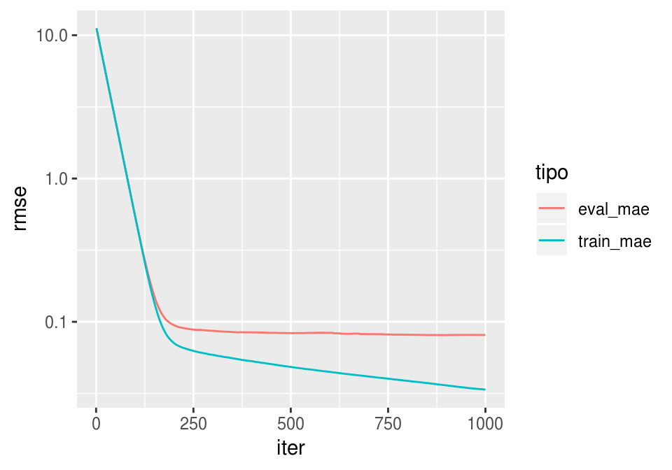


